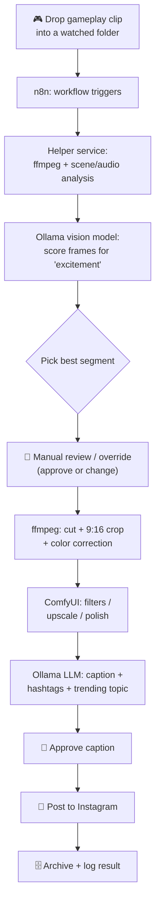
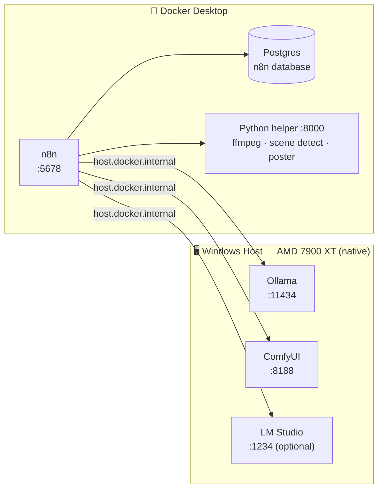

# 🎮➡️📸 Local Gameplay-to-Instagram Auto-Poster — Study Guide

A complete, beginner-friendly, **fully local** build guide. You drop in a 2–5 minute gameplay
clip, and an automated pipeline finds the best moment, edits it into an Instagram-ready Reel,
writes a caption with hashtags, lets you approve it, and posts it to Instagram — orchestrated by
**n8n**, powered by your **local AI tools** (Ollama, LM Studio, ComfyUI).

> This is the **master index**. Each "Part" below becomes its own Markdown file inside the
> `prep/` folder. This is a **hands-on lab, not a theory course** — every Part is click-by-click
> ("go here → add this node → set this value → connect it to that"), plus copy-paste
> **cheat sheets**. No concepts-from-scratch lectures. We build **one Part at a time**; say
> **"next"** (or name a Part) and I'll write that file.

---

## 📌 Your Project at a Glance

| Thing | Your setup |
|---|---|
| **Goal** | Drop in a gameplay clip → auto-pick best shot → edit + filter → caption + hashtags → post to Instagram, all local |
| **Experience level** | Beginner (we assume zero prior knowledge and explain every term) |
| **Operating system** | Windows |
| **GPU** | AMD Radeon RX 7900 XT (20 GB VRAM — powerful, but needs AMD-specific setup notes) |
| **Already installed** | Ollama, LM Studio, ComfyUI (freshly installed) |
| **Deployment style** | Docker Desktop for n8n; GPU tools run natively (see decision #1 below) |
| **n8n edition** | **Community Edition**, self-hosted (no license/cost) |
| **Instagram account** | Creator account, **not** linked to a Facebook Page (yet) |
| **Best-moment method** | AI vision/scene analysis (primary) **+** a manual override step |
| **AI services** | Local-first; optional cloud AI only if/where you choose |

---

## 🧭 The Key Architecture Decisions (these shape everything)

These choices come straight from your answers and drive the whole design:

1. **GPU tools run NATIVE on Windows; n8n runs in Docker.**
   AMD GPUs do **not** pass cleanly into Docker on Windows. So Ollama + ComfyUI run directly on
   Windows (using your 7900 XT), while n8n + its database + a small helper service run in Docker.
   n8n reaches the native tools through a special address called `host.docker.internal`.

2. **Instagram needs a decision.** The official, reliable, free Instagram publishing API requires
   your Creator account to be connected to a **Facebook Page**. You can add a Page in ~5 minutes
   (it stays invisible and doesn't change your profile). We'll **recommend that path**, but also
   document an **unofficial fallback** (with clear risks/TOS warnings) in case you don't want a Page.

3. **Best-moment detection = AI + signals, with a human override.** We sample frames and score them
   with a local **vision model**, combine that with **audio loudness** and **scene cuts**, then pick
   the strongest window. A **manual review step** lets you confirm or pick a different moment anytime.

4. **Everything is local by default.** Each AI step runs on your machine. Cloud AI is an *optional*
   plug-in only where you decide it's worth it (e.g., a smarter caption model). Nothing leaves your
   PC unless you choose it to.

5. **n8n Community Edition (self-hosted).** Good news: self-hosting unlocks the nodes this lab
   needs — **Execute Command**, **Read/Write Files from Disk**, **Code**, **Webhook**, **Wait**,
   and **Form** — which are blocked or limited on n8n Cloud. Heads-up: a few paid-only features
   aren't in Community (built-in **Variables**, multi-user roles, environments). Wherever we'd use
   those, the lab swaps in a Community-friendly substitute (env vars, a config **Set** node, or a
   credential) and I'll flag it each time.

---

## 🗺️ The Big Picture — What We're Building

**The pipeline (what happens to your clip):**



**The deployment (what runs where):**



---

## 🧩 The Tech Stack (what each piece does, in plain English)

| Tool | Plain-English job | Where it runs |
|---|---|---|
| **n8n** | The "conductor" — connects every step into one automated flow | Docker |
| **Docker Desktop** | Runs apps in tidy, isolated boxes so installs don't fight each other | Windows |
| **Ollama** | Runs local AI models (text **and** vision) behind a simple API | Native (GPU) |
| **LM Studio** | Alternative local AI model server (optional, OpenAI-compatible) | Native (GPU) |
| **ComfyUI** | Node-based image/video AI — filters, upscaling, visual polish | Native (GPU) |
| **ffmpeg** | The Swiss-army knife for cutting, cropping, and encoding video | Helper container |
| **Python helper** | Small custom service for scene detection, audio scoring, Instagram posting | Docker |
| **Postgres** | n8n's memory — stores your workflows and run history reliably | Docker |

---

## 📚 The Index — Your Lab Path (orientation → build → operate)

> **Every build Part includes:** the exact **n8n nodes** to add (name + settings + how to wire
> them together), any **ComfyUI nodes** and connections, the **credentials/integration** setup,
> and a **copy-paste cheat sheet** — so you never have to guess "what node comes next."

### Group 1 — Lab Orientation
- **Part A — Lab Map & Cheat Sheets (fast orientation, no theory)**
  - A1. Pre-flight checklist: what to have installed & ready before Part B
  - A2. Ports, URLs & folders cheat sheet (what lives where)
  - A3. "Which tool does which job" quick-reference table
  - A4. n8n Community Edition cheat sheet (what you can/can't use + substitutes)
  - A5. Glossary-as-cheat-sheet (one-line lookups only — not a lecture)

### Group 2 — Environment Setup (install everything & make it talk)
- **Part B — Installing the Foundation (Docker, n8n, Project Layout)**
  - B1. Install & sanity-check Docker Desktop on Windows
  - B2. The project folder structure (where everything lives)
  - B3. The `docker-compose` file for n8n + Postgres
  - B4. First launch: the editor, your login, and basic security
- **Part C — Wiring Up Your Local AI (Ollama, LM Studio, ComfyUI on AMD)**
  - C1. AMD-on-Windows reality: ROCm vs DirectML vs ZLUDA (what to use)
  - C2. Ollama: pull a text model + a vision model, expose the API
  - C3. Connect n8n → Ollama via `host.docker.internal` and test it
  - C4. LM Studio as an OpenAI-compatible server (optional)
  - C5. ComfyUI in API mode + your first API test
  - C6. Build the Python helper service (ffmpeg, scene detection, poster)

### Group 3 — Building the Pipeline, Stage by Stage
- **Part D — Stage 1: Ingest & Preprocess (Watch Folder + ffmpeg Basics)**
- **Part E — Stage 2: Finding the Best Moment (AI + Audio/Scene Scoring)**
- **Part F — Stage 3: The Manual Override (Review & Pick the Clip)**
- **Part G — Stage 4: Editing & Insta-Formatting (Cut, 9:16, Color, ComfyUI)**
- **Part H — Stage 5: Caption, Hashtags & Trending Topics (Ollama)**
- **Part I — Stage 6: Posting to Instagram (Account Setup + Both Paths)**

### Group 4 — Assemble & Operate
- **Part J — The Full Workflow Assembled (End-to-End, Errors, Retries, Alerts)**
- **Part K — Run, Troubleshoot & Level Up (Ops, Backups, AMD Performance, TOS, Next Features)**

### Group 5 — Extras & Accelerators
- **Part L — Ready-to-Import n8n Workflow (skip manual node-building)**
- **Part M — Helper Add-ons: Subtitles (Whisper) + Blurred-Letterbox**
- **Part N — One-Page Quick-Start (Parts B→I condensed)**

---

## ✅ Progress Tracker

| Part | What you'll build / learn | File | Status |
|---|---|---|---|
| A | Lab map, cheat sheets & pre-flight checklist | [prep/Part-A-Lab-Map-And-Cheat-Sheets.md](prep/Part-A-Lab-Map-And-Cheat-Sheets.md) | ✅ Done |
| B | Docker + n8n running locally | [prep/Part-B-Installing-The-Foundation.md](prep/Part-B-Installing-The-Foundation.md) | ✅ Done |
| C | Local AI wired into n8n | [prep/Part-C-Wiring-Up-Local-AI.md](prep/Part-C-Wiring-Up-Local-AI.md) | ✅ Done |
| D | Ingest & preprocess stage | [prep/Part-D-Ingest-And-Preprocess.md](prep/Part-D-Ingest-And-Preprocess.md) | ✅ Done |
| E | Best-moment detection stage | [prep/Part-E-Finding-The-Best-Moment.md](prep/Part-E-Finding-The-Best-Moment.md) | ✅ Done |
| F | Manual override stage | [prep/Part-F-Manual-Override.md](prep/Part-F-Manual-Override.md) | ✅ Done |
| G | Editing & Insta-formatting stage | [prep/Part-G-Editing-And-Insta-Formatting.md](prep/Part-G-Editing-And-Insta-Formatting.md) | ✅ Done |
| H | Caption + hashtags + trends stage | [prep/Part-H-Caption-Hashtags-Trends.md](prep/Part-H-Caption-Hashtags-Trends.md) | ✅ Done |
| I | Instagram posting stage | [prep/Part-I-Posting-To-Instagram.md](prep/Part-I-Posting-To-Instagram.md) | ✅ Done |
| J | Full workflow assembled | [prep/Part-J-Full-Workflow-Assembled.md](prep/Part-J-Full-Workflow-Assembled.md) | ✅ Done |
| K | Operations & leveling up | [prep/Part-K-Run-Troubleshoot-Level-Up.md](prep/Part-K-Run-Troubleshoot-Level-Up.md) | ✅ Done |
| L | Ready-to-import n8n workflow | [prep/Part-L-Ready-To-Import-Workflow.md](prep/Part-L-Ready-To-Import-Workflow.md) | ✅ Done |
| M | Subtitles + letterbox add-ons | [prep/Part-M-Helper-Addons-Subtitles-Letterbox.md](prep/Part-M-Helper-Addons-Subtitles-Letterbox.md) | ✅ Done |
| N | One-page quick-start | [prep/Part-N-One-Page-Quick-Start.md](prep/Part-N-One-Page-Quick-Start.md) | ✅ Done |

---

## ▶️ How to Use This Lab

1. **Read this index** and make sure the order makes sense for you.
2. Say **"next"** to build **Part A**, or name any Part to jump there.
3. We do **one Part per file** — pure lab steps (click here, add this node, paste this) plus
   cheat sheets — then I summarize and ask what's next.
4. Give feedback anytime ("more detail", "shorter", "more on ComfyUI wiring") — I'll apply it
   going forward and can back-fill earlier files.

> **Suggested start:** Part A (a 1-page orientation + cheat sheets) — then Part B to get n8n
> running. Want to skip straight to installing? Say **"start at Part B"**.
```

