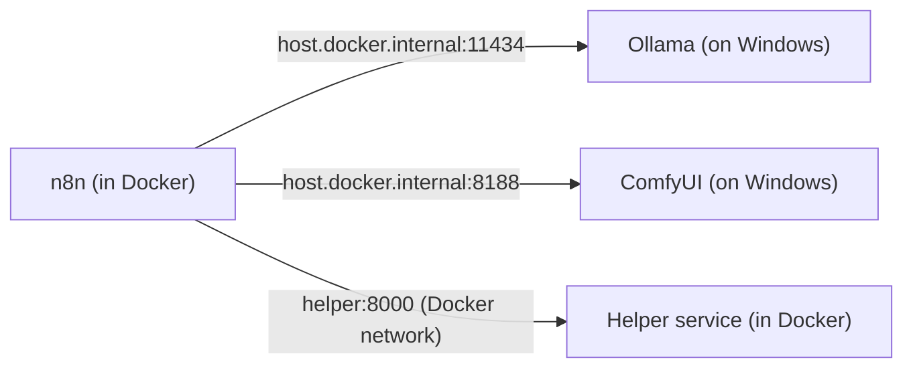

# Part A — Lab Map & Cheat Sheets

> **What this Part is:** your reference card + pre-flight check. No theory. By the end you'll have
> **confirmed your GPU tools work**, and you'll know **where everything lives** (ports, folders,
> URLs) before we start installing in Part B. **Bookmark this page** — you'll come back to it.

---

## A1. Pre-flight checklist (do this BEFORE Part B)

Tick each box. The "How to check" column gives you the exact thing to run/look at.

| ✅ | Check | How to check | What you want to see |
|----|-------|--------------|----------------------|
| ⬜ | Windows 10/11 64-bit | Press `Win + R`, type `winver`, Enter | Windows 10 (2004+) or Windows 11 |
| ⬜ | AMD driver up to date | Open **AMD Software: Adrenalin** → check for updates | Latest Adrenalin installed |
| ⬜ | Ollama installed | In **PowerShell**: `ollama --version` | A version number prints |
| ⬜ | Ollama uses your GPU | `ollama ps` while a model runs (see below) | `PROCESSOR` shows **GPU**, not CPU |
| ⬜ | A text model pulled | `ollama list` | At least one model listed |
| ⬜ | ComfyUI launches | Start ComfyUI, open <http://127.0.0.1:8188> | The node canvas loads |
| ⬜ | (Optional) LM Studio | Open LM Studio app | App opens, can load a model |
| ⬜ | Sample gameplay clip | Find a 2–5 min `.mp4` from OBS / AMD ReLive | File plays in a video player |
| ⬜ | Free disk space | File Explorer → This PC | **≥ 30 GB** free (models + video are big) |
| ⬜ | Can install software | You're on an admin account | Needed for Docker in Part B |

### Run these quick checks (copy-paste into PowerShell)

**1) Ollama is alive and has a model:**

```powershell
ollama --version
ollama list
```

If `ollama list` is empty, pull a small, fast text model now (we'll use it for captions later):

```powershell
ollama pull llama3.2:3b
```

**2) Confirm Ollama is using your 7900 XT (not the CPU):**

```powershell
# Start a model in one window:
ollama run llama3.2:3b "say hello in three words"

# In a SECOND PowerShell window, while it's loaded, run:
ollama ps
```

In `ollama ps`, look at the **PROCESSOR** column:

- ✅ `100% GPU` → perfect, your AMD card is being used.
- ⚠️ `100% CPU` → it works but it's slow; note it and continue (we'll revisit in Part K).

> 🟥 **AMD note:** Your RX 7900 XT (code `gfx1100`) is on Ollama's supported-AMD list, so GPU should
> "just work" on Windows via ROCm. If it falls back to CPU, **update the Adrenalin driver and
> reboot** — that fixes it 90% of the time. You do **not** need any `HSA_OVERRIDE` hacks for this card.

**3) ComfyUI opens:** start it the way you installed it (a `.bat` like `run.bat`, a ZLUDA bat, or the
DirectML launcher), then open <http://127.0.0.1:8188>. Look at the **startup console window** — it
prints the device it's using. You'll see one of these:

| Console says… | Means you installed… | Fine for this lab? |
|---|---|---|
| `Using directml` | ComfyUI-DirectML build | ✅ Yes (a bit slower) |
| `Using cuda` / mentions **ZLUDA** | ZLUDA build (CUDA-on-AMD shim) | ✅ Yes (fastest on AMD/Windows) |
| `Using cpu` | No GPU acceleration | ⚠️ Works but slow |

> You don't need ComfyUI until **Part G** — for now, "it opens and can run the default workflow"
> is all we need. Note which build you have; I'll tailor Part G to it.

---

## A2. Ports, URLs & folders cheat sheet

### Where each service answers (memorize the right-hand column)

| Service | Runs in | Open in browser | **Address n8n uses to reach it** |
|---|---|---|---|
| **n8n** (the conductor) | Docker | <http://localhost:5678> | — (n8n *is* the caller) |
| **Ollama** (AI models) | Native Windows | <http://localhost:11434> | `http://host.docker.internal:11434` |
| **ComfyUI** (image/video AI) | Native Windows | <http://127.0.0.1:8188> | `http://host.docker.internal:8188` |
| **LM Studio** (optional AI) | Native Windows | <http://localhost:1234/v1> | `http://host.docker.internal:1234/v1` |
| **Helper service** (ffmpeg etc.) | Docker | <http://localhost:8000> | `http://helper:8000` (same Docker network) |
| **Postgres** (n8n's database) | Docker | (no browser) | `postgres:5432` (internal only) |

> 🟥 **The #1 gotcha you'll hit:** n8n runs **inside Docker**, so to it `localhost` means *"inside my
> own box"*, **not your Windows PC**. To call Ollama/ComfyUI (which run on Windows), n8n must use
> **`host.docker.internal`** instead of `localhost`. Burn this in now:



### Project folder layout (we create this in Part B)

```text
gameplay-autopost/
├─ docker-compose.yml      # defines n8n + Postgres + helper (Part B)
├─ .env                    # your settings/secrets (ports, passwords, tokens)
├─ n8n-data/               # n8n saves your workflows + encryption key here
├─ helper/                 # the Python helper service
│  ├─ Dockerfile
│  └─ app.py
├─ media/
│  ├─ inbox/               # ⬅️ you DROP gameplay clips here
│  ├─ work/                # temp files while processing
│  ├─ output/              # finished Insta-ready reels
│  └─ archive/             # clips that were already posted
└─ config/                 # caption prompts, hashtag lists, settings
```

---

## A3. "Which tool does which job" quick-reference

| Pipeline stage | Tool that does it | When it runs | Leverage tip |
|---|---|---|---|
| Watch the inbox folder, run the flow | **n8n** | Always (trigger) | The brain; everything routes through here |
| Cut / crop / re-encode video | **ffmpeg** (in helper) | Every clip | Fast, CPU-friendly; no GPU needed for short clips |
| Detect scene cuts & loud moments | **PySceneDetect + ffmpeg** (helper) | Finding best shot | Cheap signals; run first to narrow the search |
| Score frames for "exciting?" | **Ollama vision model** | Finding best shot | Only score a few sampled frames — don't waste GPU |
| Color correct / format to 9:16 | **ffmpeg** (helper) | Every clip | Built-in filters cover most needs |
| Heavy visual polish / upscale / style | **ComfyUI** | **Only when you want it** | Skip it for normal clips — it's the slowest step |
| Write caption + hashtags | **Ollama** (or LM Studio) | Every post | Local model is plenty for captions |
| Post to Instagram | **Helper service** (Graph API or fallback) | Final step | Covered in Part I |

> 💡 **"Leverage as needed":** ffmpeg handles ~90% of editing cheaply. Save **ComfyUI** (GPU-heavy)
> for clips where you actually want fancy filters/upscaling, so the pipeline stays fast.

---

## A4. n8n Community Edition cheat sheet

You're on **Community Edition (CE)**, self-hosted. Here's what matters for this lab.

### ✅ Nodes you CAN use (and we will)

| Node | What you'll use it for |
|---|---|
| **Local File Trigger** | Watch the `inbox/` folder for new clips |
| **Execute Command** | Run `curl`/helper calls or scripts (self-host only!) |
| **HTTP Request** | Talk to Ollama, ComfyUI, helper, Instagram API |
| **Code** | Small JS/Python transforms (pick best segment, build JSON) |
| **Read/Write Files from Disk** | Move clips between `work/`, `output/`, `archive/` |
| **Edit Fields (Set)** | Hold config values & shape data between steps |
| **IF / Switch** | Branch logic (e.g., "score high enough?") |
| **Wait / Form Trigger** | The manual review/approval steps (Part F) |
| **Merge** | Recombine branches |
| **Execute Sub-workflow** | Split the big flow into reusable pieces |
| **Schedule Trigger** | Time-based posting (optional) |
| **Error Trigger** | Catch failures and alert you (Part J) |

### 🔒 Paid-only features (NOT in CE) → free substitute we'll use instead

| Missing in CE | Free substitute in this lab |
|---|---|
| **Variables** (global `$vars`) | Put settings in `.env` (Docker) + a **Set** "Config" node |
| Multiple users / roles | Single owner login (fine for a solo lab) |
| **Environments** (dev/prod) | One setup; back up `n8n-data/` if you want a copy |
| **External secrets** | n8n **Credentials** store + `.env` |
| Git version control | Manually **Export** workflows to JSON (Part K) |

### How to install a community node (if a Part ever needs one)

1. In n8n: **Settings** (bottom-left) → **Community nodes** → **Install**.
2. Type the npm package name (e.g., `n8n-nodes-something`) → **Install**.
3. It appears in the node panel after a refresh.

> We mostly use **built-in** nodes, so you likely won't need this — but now you know how.

---

## A5. Glossary cheat sheet (one-line lookups only)

**n8n world**
- **Workflow** — your automation, made of connected nodes (a flowchart that runs).
- **Node** — one step/box in the workflow (e.g., "HTTP Request").
- **Trigger** — the node that *starts* a workflow (a new file, a schedule, a webhook).
- **Credential** — a saved, encrypted login/key you attach to nodes.
- **Webhook** — a URL that, when called, kicks off a workflow.
- **Execution** — one run of a workflow (with its data + logs).

**Docker world**
- **Image** — a frozen template of an app (e.g., the n8n image).
- **Container** — a running copy of an image (the live app).
- **docker-compose** — one `.yml` file that starts several containers together.
- **Volume / bind mount** — a folder shared between your PC and a container (so data survives).
- **`host.docker.internal`** — the address a container uses to reach apps on your Windows PC.

**AI / media world**
- **Ollama** — runs local AI models behind a simple web API.
- **LLM** — a text AI model (writes captions, etc.).
- **Vision model** — an AI model that can "look at" an image and describe/score it.
- **ComfyUI** — node-based image/video AI for filters, upscaling, effects.
- **ffmpeg** — command-line tool to cut, crop, convert, and filter video.
- **Reel** — Instagram's short vertical video format, **9:16** (1080×1920).
- **Graph API** — Instagram/Facebook's official API for posting (needs a Page link).
- **Access token** — the secret key that lets the API post on your behalf.
- **ROCm / DirectML / ZLUDA** — the three ways AMD GPUs run AI on Windows (Part C picks one).
- **VRAM** — your GPU's memory (you have 20 GB — lots of headroom).

---

## ✅ Checkpoint — you're ready for Part B when:

- [ ] `ollama list` shows a model, and `ollama ps` shows **GPU** while one runs.
- [ ] ComfyUI opens at <http://127.0.0.1:8188> and you noted your build (DirectML/ZLUDA/CPU).
- [ ] You have a 2–5 min `.mp4` gameplay clip handy.
- [ ] You have ~30 GB free and an admin account.

## 🧠 30-Second Memory Hooks

- **n8n is in a box** → it can't say `localhost` for your PC tools; it says **`host.docker.internal`**.
- **ffmpeg first, ComfyUI only when fancy** → keep the pipeline fast.
- **CE has no Variables** → settings live in **`.env` + a Set node**.
- **Drop clips in `media/inbox/`**, finished reels land in `media/output/`.

## ➡️ Next

**Part B — Installing the Foundation**: install Docker Desktop, create the project folders, and get
**n8n running** with one `docker-compose` file. Say **"next"** to build it.
