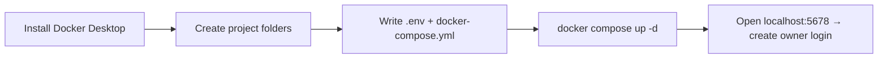

# Part B — Installing the Foundation (Docker + n8n)

> **Goal of this Part:** install Docker Desktop, create your project folders, and get **n8n running**
> at <http://localhost:5678> using one `docker-compose.yml`. Pure steps. ~20 minutes.



---

## B1. Install Docker Desktop

1. Download **Docker Desktop for Windows**: <https://www.docker.com/products/docker-desktop/>
2. Run the installer. **Keep "Use WSL 2 instead of Hyper-V" checked.**
3. **Reboot** when it asks.
4. Launch **Docker Desktop**. Wait for the whale icon (bottom-right tray) to go **steady/green**
   ("Engine running").
5. Verify in **PowerShell**:

```powershell
docker --version
docker compose version
docker run --rm hello-world
```

You want a version number for the first two, and a "Hello from Docker!" message from the third.

> 🟥 **If Docker won't start:** open **PowerShell as Administrator** and run `wsl --update`, then
> reboot and start Docker Desktop again.

---

## B2. Create the project folders

Pick a short path (avoid spaces). We'll use `C:\gameplay-autopost`. Paste this whole block into
**PowerShell**:

```powershell
$root = "C:\gameplay-autopost"
$dirs = @("n8n-data","postgres-data","helper","config",
          "media\inbox","media\work","media\output","media\archive")
foreach ($d in $dirs) { New-Item -ItemType Directory -Force -Path "$root\$d" | Out-Null }
cd $root
explorer .
```

You now have the full folder tree from Part A.

---

## B3. Create `.env` and `docker-compose.yml`

### 1) Generate a secret encryption key

```powershell
# Run this and COPY the output — you'll paste it into .env below
-join ((48..57)+(65..90)+(97..122) | Get-Random -Count 48 | ForEach-Object {[char]$_})
```

### 2) Create the `.env` file

Create `C:\gameplay-autopost\.env` with this content (replace the two values):

```ini
# --- Database ---
POSTGRES_PASSWORD=choose_a_strong_password_here

# --- n8n ---
N8N_ENCRYPTION_KEY=paste_the_48_char_key_you_generated

# --- Timezone (change to yours, e.g. Asia/Kolkata, America/New_York) ---
GENERIC_TIMEZONE=Etc/UTC
```

> ⚠️ The **encryption key never changes** once set — it's what unlocks your saved credentials.
> If you lose it, you lose your saved logins. Keep `.env` safe and don't delete it.

### 3) Create `docker-compose.yml`

Create `C:\gameplay-autopost\docker-compose.yml`:

```yaml
services:
  postgres:
    image: postgres:16
    restart: unless-stopped
    environment:
      - POSTGRES_USER=n8n
      - POSTGRES_PASSWORD=${POSTGRES_PASSWORD}
      - POSTGRES_DB=n8n
    volumes:
      - ./postgres-data:/var/lib/postgresql/data
    healthcheck:
      test: ['CMD-SHELL', 'pg_isready -U n8n -d n8n']
      interval: 10s
      timeout: 5s
      retries: 5

  n8n:
    image: docker.n8n.io/n8nio/n8n:latest
    restart: unless-stopped
    ports:
      - "5678:5678"
    environment:
      - DB_TYPE=postgresdb
      - DB_POSTGRESDB_HOST=postgres
      - DB_POSTGRESDB_PORT=5432
      - DB_POSTGRESDB_DATABASE=n8n
      - DB_POSTGRESDB_USER=n8n
      - DB_POSTGRESDB_PASSWORD=${POSTGRES_PASSWORD}
      - N8N_ENCRYPTION_KEY=${N8N_ENCRYPTION_KEY}
      - N8N_HOST=localhost
      - N8N_PORT=5678
      - N8N_PROTOCOL=http
      - WEBHOOK_URL=http://localhost:5678/
      - N8N_SECURE_COOKIE=false
      - GENERIC_TIMEZONE=${GENERIC_TIMEZONE}
      - TZ=${GENERIC_TIMEZONE}
      - N8N_DEFAULT_BINARY_DATA_MODE=filesystem
      - NODE_FUNCTION_ALLOW_EXTERNAL=*
    volumes:
      - ./n8n-data:/home/node/.n8n
      - ./media:/data/media
    extra_hosts:
      - "host.docker.internal:host-gateway"
    depends_on:
      postgres:
        condition: service_healthy
```

**What the key lines do (quick reference):**

| Line | Why it's there |
|---|---|
| `./media:/data/media` | n8n sees your clips at `/data/media` inside the container |
| `extra_hosts: host.docker.internal` | lets n8n reach Ollama/ComfyUI on Windows |
| `N8N_SECURE_COOKIE=false` | allows login over plain `http://localhost` |
| `N8N_DEFAULT_BINARY_DATA_MODE=filesystem` | handles big video files without eating RAM |
| `N8N_ENCRYPTION_KEY` | persists your saved credentials across restarts |

---

## B4. Launch n8n

From `C:\gameplay-autopost` in PowerShell:

```powershell
docker compose up -d
docker compose ps
```

Both services should show **running/healthy** (give Postgres ~20s the first time).

1. Open <http://localhost:5678>.
2. **Create your owner account** (email + password — stored locally, this is just your login).
3. If it asks for a license/email to unlock features, you can **skip** — everything in this lab is
   Community Edition.
4. You'll land on the **Workflows** screen. Click **Create Workflow** to see the empty canvas — this
   is where you'll add nodes in Part D.

### Daily commands cheat sheet

| Task | Command (run inside `C:\gameplay-autopost`) |
|---|---|
| Start | `docker compose up -d` |
| Stop | `docker compose down` |
| Restart just n8n | `docker compose restart n8n` |
| See logs (live) | `docker compose logs -f n8n` |
| Update n8n | `docker compose pull n8n && docker compose up -d` |

> 🟥 **`down` does NOT delete your data** — workflows live in `./n8n-data` and `./postgres-data`.
> Only `docker compose down -v` would wipe volumes, so avoid the `-v` flag.

---

## ✅ Checkpoint

- [ ] `docker compose ps` shows **n8n** and **postgres** running.
- [ ] You logged into n8n at <http://localhost:5678> and saw the canvas.
- [ ] `.env` and `docker-compose.yml` exist in `C:\gameplay-autopost`.

## 🧠 Memory Hooks

- **`up -d` to start, `down` to stop, `logs -f` to watch.** `-v` = danger (wipes data).
- **Your secrets live in `.env`** — back it up.
- **`./media` on Windows == `/data/media` inside n8n.**

## ➡️ Next

**Part C — Wiring Up Your Local AI**: make Ollama + ComfyUI reachable from n8n (the
`host.docker.internal` setup), pull your models, and add the Python helper container. Say **"next"**.
