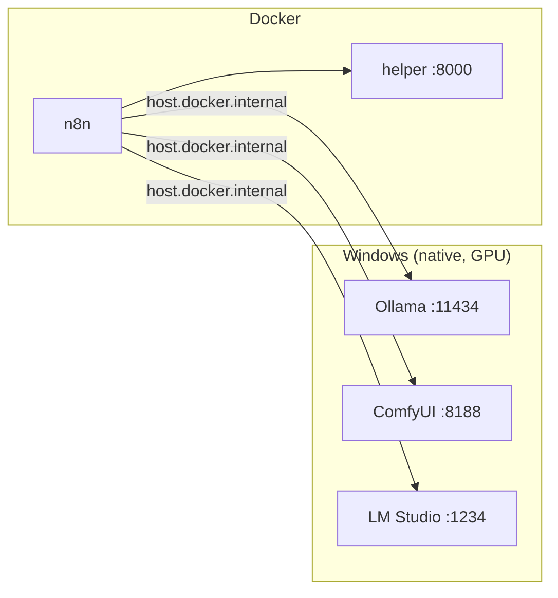

# Part C — Wiring Up Your Local AI (Ollama, LM Studio, ComfyUI)

> **Goal:** make your native GPU tools reachable from n8n (which lives in Docker), pull the AI
> models you'll use, and add the **Python helper** container that runs ffmpeg + scene detection +
> Instagram posting. After this Part, n8n can "talk to" everything.



---

## C1. AMD-on-Windows reality (30-second decision)

| Tool | What to use on your 7900 XT | Action |
|---|---|---|
| **Ollama** | Built-in ROCm (automatic) | Nothing to choose — just expose it (C2) |
| **ComfyUI** | **ZLUDA** build = fastest; **DirectML** = easiest | Use whichever you already installed |
| **LM Studio** | Vulkan/ROCm runtime (automatic) | Optional — only if you want it (C4) |

> You confirmed your ComfyUI build in Part A. Either works for this lab. We don't touch ComfyUI's
> internals — we only turn on its **API listen mode** (C5).

---

## C2. Ollama — expose the API + pull models

### 1) Make Ollama listen so Docker can reach it (CRITICAL)

By default Ollama only answers `127.0.0.1`, which **Docker containers can't reach**. Fix it once:

```powershell
setx OLLAMA_HOST "0.0.0.0"
```

Then **fully restart Ollama**: right-click the Ollama icon in the system tray → **Quit**, then
launch Ollama again from the Start menu. (The `setx` only takes effect in apps started *after* it.)

### 2) Pull the models you'll use

```powershell
ollama pull llama3.1:8b          # text model → captions & hashtags
ollama pull llava:7b             # vision model → score frames for "best moment"
```

> 💡 You have 20 GB VRAM, so you *can* go bigger later (`llama3.2-vision:11b` for sharper frame
> scoring). Start with these — they're fast and good enough to build the whole pipeline.

### 3) Verify it works AND is reachable from inside Docker

```powershell
# From Windows (native):
curl http://localhost:11434/api/tags

# From INSIDE the n8n container (this proves host.docker.internal works):
docker exec -it gameplay-autopost-n8n-1 sh -c "wget -qO- http://host.docker.internal:11434/api/tags"
```

Both should return JSON listing your models. If the container name differs, find it with
`docker compose ps`.

> 🟥 **If the second command fails:** Ollama isn't listening on `0.0.0.0`. Re-check step 1, fully
> quit/relaunch Ollama, and allow it through Windows Firewall if prompted.

---

## C3. Test Ollama from an n8n workflow

1. In n8n, **Create Workflow** → on the canvas click the **+** (top-right) to add a node.
2. Add a **Manual Trigger** (search "Manual"). It drops a "When clicking Test workflow" node.
3. Click **+** to its right → add an **HTTP Request** node. Set:

   | Field | Value |
   |---|---|
   | **Method** | `POST` |
   | **URL** | `http://host.docker.internal:11434/api/generate` |
   | **Body Content Type** | `JSON` |
   | **Specify Body** | `Using JSON` |
   | **JSON** | see below |

   ```json
   {
     "model": "llama3.1:8b",
     "prompt": "Reply with exactly: wiring works",
     "stream": false
   }
   ```

4. Click **Test workflow** (bottom). In the HTTP Request output you should see a `response` field
   containing *"wiring works"*.

✅ That round-trip (n8n → Ollama → back) is the exact pattern we reuse for captions and frame scoring.

> **Shortcut:** n8n also has a built-in **Ollama** credential + AI nodes. To use them, create an
> **Ollama** credential with Base URL `http://host.docker.internal:11434`. The raw **HTTP Request**
> above works everywhere, so we'll standardize on it.

---

## C4. LM Studio as a backup AI server (optional — skip if unsure)

1. Open **LM Studio** → load a model (e.g., a 7B instruct model).
2. Go to the **Developer / Local Server** tab → toggle **Serve on Local Network** (binds `0.0.0.0`).
3. Start the server (default port **1234**). It's **OpenAI-compatible**.
4. Test from n8n with an HTTP Request:
   - **URL:** `http://host.docker.internal:1234/v1/chat/completions`
   - **Body (JSON):**
     ```json
     {
       "model": "local-model",
       "messages": [{"role": "user", "content": "say hi"}]
     }
     ```

> Use Ollama as your default; keep LM Studio as a swap-in if you prefer a model it hosts.

---

## C5. ComfyUI — turn on API listen mode

ComfyUI already has an API at port **8188**, but by default it only listens on `127.0.0.1`. Make it
reachable from Docker:

1. Find your ComfyUI **launch `.bat`** (e.g., `run.bat`, `run_nvidia_gpu.bat`, or your ZLUDA bat).
2. Edit it and add `--listen 0.0.0.0` to the python line. Example:

   ```bat
   .\python_embeded\python.exe -s ComfyUI\main.py --listen 0.0.0.0 --port 8188
   ```

3. Save, **restart ComfyUI** using that bat.
4. Test reachability from inside Docker:

   ```powershell
   docker exec -it gameplay-autopost-n8n-1 sh -c "wget -qO- http://host.docker.internal:8188/system_stats"
   ```

   JSON about your GPU/RAM = success.

> We only *prove the connection* now. The actual ComfyUI node graph for filters/upscaling comes in
> **Part G** — and we keep it optional so the pipeline stays fast.

---

## C6. Add the Python helper service (ffmpeg + scene detect + poster)

This small container does the video heavy-lifting. Create three files in
`C:\gameplay-autopost\helper\`.

### 1) `helper/requirements.txt`

```text
fastapi
uvicorn[standard]
scenedetect[opencv-headless]
instagrapi
requests
pillow
```

### 2) `helper/Dockerfile`

```dockerfile
FROM python:3.11-slim
RUN apt-get update && apt-get install -y --no-install-recommends ffmpeg \
    && rm -rf /var/lib/apt/lists/*
WORKDIR /app
COPY requirements.txt .
RUN pip install --no-cache-dir -r requirements.txt
COPY app.py .
CMD ["uvicorn", "app:app", "--host", "0.0.0.0", "--port", "8000"]
```

### 3) `helper/app.py` (starter — we extend it in D, E, G, I)

```python
import os, json, subprocess
from fastapi import FastAPI
from pydantic import BaseModel

app = FastAPI()
MEDIA = "/data/media"

@app.get("/health")
def health():
    return {"status": "ok"}

class ProbeIn(BaseModel):
    path: str  # relative to media, e.g. "inbox/clip.mp4"

@app.post("/probe")
def probe(inp: ProbeIn):
    full = os.path.join(MEDIA, inp.path)
    if not os.path.exists(full):
        return {"error": "file not found", "path": full}
    cmd = ["ffprobe", "-v", "quiet", "-print_format", "json",
           "-show_format", "-show_streams", full]
    out = subprocess.run(cmd, capture_output=True, text=True)
    data = json.loads(out.stdout or "{}")
    fmt = data.get("format", {})
    v = next((s for s in data.get("streams", []) if s.get("codec_type") == "video"), {})
    return {
        "duration": float(fmt.get("duration", 0) or 0),
        "size": int(fmt.get("size", 0) or 0),
        "width": v.get("width"),
        "height": v.get("height"),
        "fps": v.get("r_frame_rate"),
    }
```

### 4) Add the helper to `docker-compose.yml`

Open `docker-compose.yml` and add this service **under** the `n8n` service (same indentation level):

```yaml
  helper:
    build: ./helper
    restart: unless-stopped
    ports:
      - "8000:8000"
    volumes:
      - ./media:/data/media
      - ./config:/data/config
    extra_hosts:
      - "host.docker.internal:host-gateway"
```

### 5) Build and test

```powershell
cd C:\gameplay-autopost
docker compose up -d --build helper
curl http://localhost:8000/health
```

You want `{"status":"ok"}`. Then test it from **inside n8n** (this is how n8n will call it):

```powershell
docker exec -it gameplay-autopost-n8n-1 sh -c "wget -qO- http://helper:8000/health"
```

> 🟥 **Note the address difference:** n8n reaches the **helper** at `http://helper:8000` (same Docker
> network — use the service name), but reaches **Ollama/ComfyUI** at `http://host.docker.internal:...`
> (because those run on Windows). Keep this distinction straight and you'll avoid 90% of connection
> errors.

---

## Connection cheat sheet (pin this)

| n8n needs to call… | Use this URL |
|---|---|
| Ollama | `http://host.docker.internal:11434` |
| ComfyUI | `http://host.docker.internal:8188` |
| LM Studio | `http://host.docker.internal:1234/v1` |
| Helper | `http://helper:8000` |

---

## ✅ Checkpoint

- [ ] `setx OLLAMA_HOST "0.0.0.0"` done **and** Ollama restarted.
- [ ] Models pulled: `llama3.1:8b` and `llava:7b`.
- [ ] n8n HTTP Request to Ollama returned "wiring works".
- [ ] ComfyUI started with `--listen 0.0.0.0`; `/system_stats` reachable from the container.
- [ ] Helper builds; `/health` returns ok from both Windows and inside n8n.

## 🧠 Memory Hooks

- **Native tools → `host.docker.internal`. Docker tools → service name (`helper`).**
- **Ollama must be `0.0.0.0`** or Docker can't see it.
- **ComfyUI needs `--listen 0.0.0.0`** in its bat.

## ➡️ Next

**Part D — Stage 1: Ingest & Preprocess**: build the first real workflow — detect a dropped clip,
move it to `work/`, and read its metadata via the helper. Say **"next"**.
