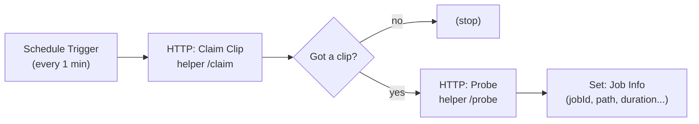

# Part D — Stage 1: Ingest & Preprocess

> **Goal:** build your first real workflow. It watches the `inbox/` folder, **claims** a dropped
> clip (moves it to `work/<job>/source.mp4`), and reads its **metadata** (duration, resolution).

> 🟥 **Why we poll instead of using the "Local File Trigger":** on Windows + Docker, file-change
> events from a bind-mounted folder are unreliable. A **Schedule Trigger that checks every minute**
> is rock-solid. That's the approach we use.



---

## D1. Add the `/claim` endpoint to the helper

Open `helper/app.py` and add this (anywhere below the imports). Then add `import shutil, glob, time`
to the top imports line.

```python
import shutil, glob, time

@app.post("/claim")
def claim():
    files = sorted(glob.glob(os.path.join(MEDIA, "inbox", "*.mp4")))
    if not files:
        return {"empty": True}
    src = files[0]
    job = time.strftime("%Y%m%d-%H%M%S")
    name = os.path.splitext(os.path.basename(src))[0]
    workdir = os.path.join(MEDIA, "work", job)
    os.makedirs(workdir, exist_ok=True)
    dst = os.path.join(workdir, "source.mp4")
    shutil.move(src, dst)
    return {"empty": False, "jobId": job, "name": name, "path": f"work/{job}/source.mp4"}
```

Rebuild the helper:

```powershell
cd C:\gameplay-autopost
docker compose up -d --build helper
```

> **What `/claim` does:** grabs the oldest `.mp4` in `inbox/`, moves it into its own `work/<job>/`
> folder, and reports back. Moving it out of `inbox/` means it can never be processed twice.

---

## D2. Build the workflow (node by node)

In n8n: **Create Workflow**, name it `1 - Ingest`. Add these nodes left-to-right.

### Node 1 — Schedule Trigger
- Add node → search **Schedule Trigger**.
- **Trigger Rule:** Interval = **Minutes**, **Every 1 minute**.

### Node 2 — HTTP Request (rename to "Claim Clip")
- Add node → **HTTP Request**. Double-click its title to rename → `Claim Clip`.
- **Method:** `POST`
- **URL:** `http://helper:8000/claim`
- Connect: **Schedule Trigger → Claim Clip**.

### Node 3 — IF (rename to "Got a clip?")
- Add node → **IF**.
- Add condition → type **Boolean**:
  - **Value 1:** `={{ $json.empty }}`
  - **Operator:** `is false`
- Connect: **Claim Clip → Got a clip?**
- (Leave the **false** output of IF unconnected — that's the "nothing to do" case.)

### Node 4 — HTTP Request (rename to "Probe")
- Add node → **HTTP Request** → rename `Probe`.
- **Method:** `POST`
- **URL:** `http://helper:8000/probe`
- **Body Content Type:** `JSON` → **Specify Body:** `Using JSON`:
  ```json
  { "path": "={{ $json.path }}" }
  ```
- Connect: **Got a clip? (true) → Probe**.

### Node 5 — Edit Fields (rename to "Job Info")
- Add node → **Edit Fields (Set)** → rename `Job Info`.
- Turn **Keep Only Set Fields** = ON. Add these fields (String/Number as noted):

  | Name | Value |
  |---|---|
  | `jobId` (string) | `={{ $('Claim Clip').item.json.jobId }}` |
  | `name` (string) | `={{ $('Claim Clip').item.json.name }}` |
  | `path` (string) | `={{ $('Claim Clip').item.json.path }}` |
  | `duration` (number) | `={{ $json.duration }}` |
  | `width` (number) | `={{ $json.width }}` |
  | `height` (number) | `={{ $json.height }}` |
- Connect: **Probe → Job Info**.

> 🔑 **Reading data from an earlier node:** `{{ $('Node Name').item.json.field }}` pulls a value
> from any previous node by its name. `{{ $json.field }}` means "the field from the node right
> before this one." You'll use these constantly.

---

## D3. Test it

1. Copy a 2–5 min `.mp4` into `C:\gameplay-autopost\media\inbox\`.
2. In n8n, click **Test workflow** (bottom bar).
3. Watch the nodes light up green. Open **Job Info** output — you should see your `jobId`, `path`
   (`work/<job>/source.mp4`), and real `duration`/`width`/`height`.
4. Check Windows: the file moved from `inbox/` into `media/work/<job>/source.mp4`. ✅

When you're happy, flip the **Active** toggle (top-right) so it runs every minute on its own.

---

## ffmpeg / ffprobe cheat sheet (reference)

| Need | Command |
|---|---|
| Get duration/size/resolution | `ffprobe -v quiet -print_format json -show_format -show_streams in.mp4` |
| Quick duration only | `ffprobe -v quiet -show_entries format=duration -of csv=p=0 in.mp4` |
| Extract 1 frame at 12s | `ffmpeg -ss 12 -i in.mp4 -frames:v 1 out.jpg` |
| Cut 15s starting at 30s | `ffmpeg -ss 30 -t 15 -i in.mp4 -c copy out.mp4` |

---

## ✅ Checkpoint

- [ ] Dropping a clip in `inbox/` → it moves to `work/<job>/source.mp4`.
- [ ] **Job Info** shows correct duration and resolution.
- [ ] Workflow runs on the 1-minute schedule when **Active**.

## 🧠 Memory Hooks

- **Poll, don't watch** (Windows + Docker file events are flaky).
- **Claim = move out of inbox** so nothing runs twice.
- **`$('Node Name').item.json.x`** grabs data from earlier nodes.

## ➡️ Next

**Part E — Finding the Best Moment**: the helper finds loud/intense windows, grabs a frame from
each, and your **vision model scores them** — then we pick the winner. Say **"next"**.
