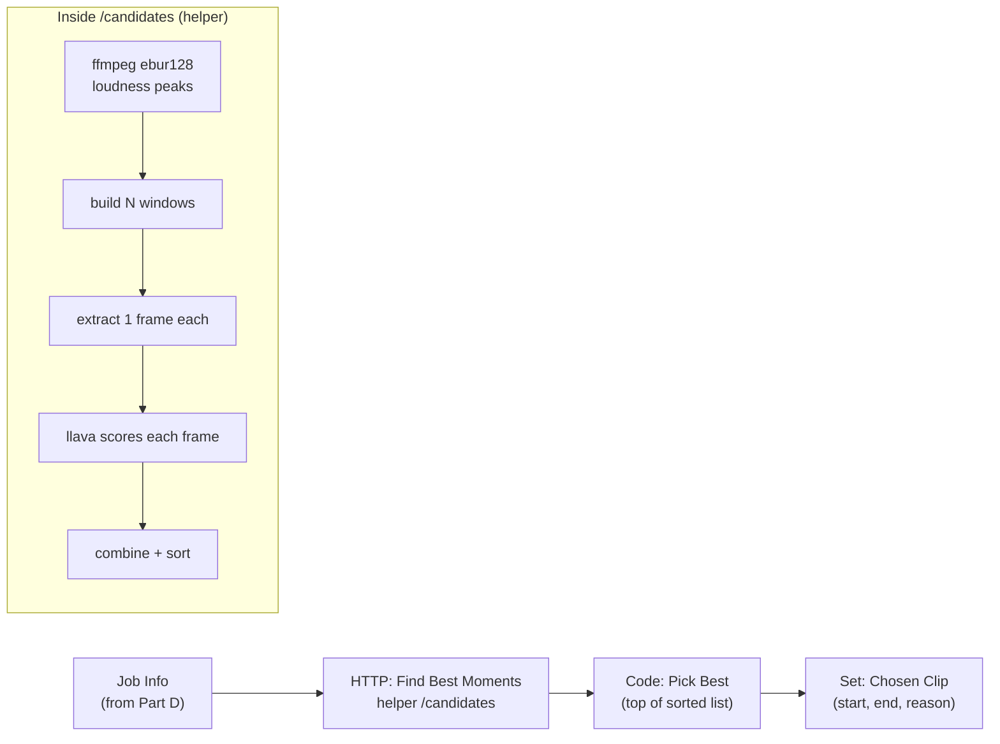

# Part E — Stage 2: Finding the Best Moment (AI + Audio)

> **Goal:** automatically pick the "best shot." The helper finds the **loudest/most intense windows**
> (audio peaks usually = kills/hype), grabs a **frame** from each, and asks your **vision model
> (llava)** to score how exciting it looks. We combine both signals and pick the winner.

> 🧠 **Why this design:** looping an AI call over many frames *inside n8n* is messy for beginners.
> So the helper does the per-frame AI scoring internally and hands n8n a **ready-sorted list**. n8n
> stays clean; you still get full AI highlight detection. (You'll do direct Ollama calls yourself in
> Part H for captions.)



---

## E1. Add the `/candidates` endpoint to the helper

This is the core of highlight detection. Add to `helper/app.py` (and add `import re, base64,
requests` to your imports). It needs Ollama's address, so we also pass an env var.

```python
import re, base64, requests

OLLAMA = os.environ.get("OLLAMA_URL", "http://host.docker.internal:11434")
VISION_MODEL = os.environ.get("VISION_MODEL", "llava:7b")

def _loudness_curve(full):
    """Return (times[], momentary_LUFS[]) using ffmpeg's ebur128 meter."""
    cmd = ["ffmpeg", "-nostats", "-i", full, "-af", "ebur128=metadata=1", "-f", "null", "-"]
    p = subprocess.run(cmd, capture_output=True, text=True)
    times, vals = [], []
    for line in p.stderr.splitlines():
        m = re.search(r"t:\s*([0-9.]+).*?M:\s*(-?[0-9.]+)", line)
        if m:
            times.append(float(m.group(1)))
            vals.append(float(m.group(2)))
    return times, vals

def _pick_peaks(times, vals, k, min_gap):
    """Greedily pick k loudest moments at least min_gap seconds apart."""
    order = sorted(range(len(vals)), key=lambda i: vals[i], reverse=True)
    chosen = []
    for i in order:
        t = times[i]
        if all(abs(t - c[0]) > min_gap for c in chosen):
            chosen.append((t, vals[i]))
        if len(chosen) >= k:
            break
    return chosen

def _extract_frame(full, t, out_path):
    subprocess.run(["ffmpeg", "-y", "-ss", str(t), "-i", full,
                    "-frames:v", "1", "-q:v", "3", out_path], capture_output=True)

def _vision_score(frame_path):
    try:
        with open(frame_path, "rb") as f:
            b64 = base64.b64encode(f.read()).decode()
        prompt = ("Rate this single gameplay frame for how exciting / hype / share-worthy it is "
                  "for a short highlight reel (action, effects, kills, intensity). "
                  'Respond ONLY as JSON: {"score": <integer 1-10>, "reason": "<max 6 words>"}')
        r = requests.post(f"{OLLAMA}/api/generate", json={
            "model": VISION_MODEL, "prompt": prompt, "images": [b64],
            "stream": False, "format": "json"}, timeout=180)
        data = json.loads(r.json().get("response", "{}"))
        return float(data.get("score", 5)), str(data.get("reason", ""))
    except Exception as e:
        return 5.0, f"score-failed:{e}"


class CandIn(BaseModel):
    path: str
    jobId: str
    clipLen: float = 15.0
    count: int = 4
    minGap: float = 8.0

@app.post("/candidates")
def candidates(inp: CandIn):
    full = os.path.join(MEDIA, inp.path)
    dur = probe(ProbeIn(path=inp.path))["duration"]
    times, vals = _loudness_curve(full)

    # peaks (or evenly spaced fallback if the clip has no/poor audio)
    if len(vals) > 5:
        peaks = _pick_peaks(times, vals, inp.count, inp.minGap)
    else:
        step = max(dur / (inp.count + 1), 1)
        peaks = [(step * (i + 1), 0.0) for i in range(inp.count)]

    frames_dir = os.path.join(MEDIA, "work", inp.jobId, "frames")
    os.makedirs(frames_dir, exist_ok=True)

    cands = []
    for i, (t, loud) in enumerate(peaks):
        start = max(0.0, t - inp.clipLen / 2)
        end = min(dur, start + inp.clipLen)
        fp = os.path.join(frames_dir, f"cand_{i}.jpg")
        _extract_frame(full, t, fp)
        score, reason = _vision_score(fp)
        cands.append({
            "idx": i, "start": round(start, 2), "end": round(end, 2),
            "peak": round(loud, 2), "vision_score": score, "reason": reason,
            "frame_rel": f"work/{inp.jobId}/frames/cand_{i}.jpg",
        })

    # normalize loudness 0..1, combine 60% vision + 40% loudness, sort best-first
    ls = [c["peak"] for c in cands]
    lo, hi = min(ls), max(ls)
    for c in cands:
        ln = (c["peak"] - lo) / (hi - lo) if hi > lo else 0.5
        c["final"] = round(0.6 * (c["vision_score"] / 10.0) + 0.4 * ln, 3)
    cands.sort(key=lambda c: c["final"], reverse=True)
    return {"dur": dur, "candidates": cands}
```

### Give the helper Ollama's address

In `docker-compose.yml`, add an `environment:` block to the **helper** service:

```yaml
  helper:
    build: ./helper
    restart: unless-stopped
    environment:
      - OLLAMA_URL=http://host.docker.internal:11434
      - VISION_MODEL=llava:7b
    ports:
      - "8000:8000"
    volumes:
      - ./media:/data/media
      - ./config:/data/config
    extra_hosts:
      - "host.docker.internal:host-gateway"
```

Rebuild:

```powershell
docker compose up -d --build helper
```

---

## E2. Build the n8n nodes

Open your `1 - Ingest` workflow and continue after **Job Info**.

### Node — HTTP Request ("Find Best Moments")
- **Method:** `POST`
- **URL:** `http://helper:8000/candidates`
- **Body → JSON:**
  ```json
  {
    "path": "={{ $json.path }}",
    "jobId": "={{ $json.jobId }}",
    "clipLen": 15,
    "count": 4,
    "minGap": 8
  }
  ```
- **Options → Timeout:** set to `300000` (5 min — vision scoring takes a bit).
- Connect: **Job Info → Find Best Moments**.

### Node — Code ("Pick Best")
- Add node → **Code** (Language: JavaScript). Paste:
  ```js
  const res = $input.first().json;
  const cands = res.candidates || [];
  if (!cands.length) { throw new Error('No candidates found'); }
  const best = cands[0];
  const job = $('Job Info').first().json;
  return [{ json: {
    jobId: job.jobId, name: job.name, path: job.path,
    start: best.start, end: best.end,
    visionScore: best.vision_score, loudPeak: best.peak,
    reason: best.reason, allCandidates: cands
  }}];
  ```
- Connect: **Find Best Moments → Pick Best**.

### Node — Edit Fields ("Chosen Clip")
- Add **Edit Fields (Set)**, Keep Only Set Fields = ON:

  | Name | Value |
  |---|---|
  | `jobId` | `={{ $json.jobId }}` |
  | `name` | `={{ $json.name }}` |
  | `path` | `={{ $json.path }}` |
  | `start` | `={{ $json.start }}` |
  | `end` | `={{ $json.end }}` |
  | `reason` | `={{ $json.reason }}` |
- Connect: **Pick Best → Chosen Clip**.

---

## E3. Test it

1. Make sure a clip has been claimed (run Part D first, or drop a new clip and Test).
2. Click **Test workflow**. The `/candidates` call will take 30–120s (it's scoring frames with
   llava on your GPU).
3. Open **Chosen Clip** output: you should see a `start`, `end`, and a short `reason` like
   *"big team fight"*.
4. Peek at the frames the AI judged: open
   `C:\gameplay-autopost\media\work\<job>\frames\cand_0.jpg` …`cand_3.jpg`.

> 🟥 **All scores look the same / always 5?** llava returned non-JSON. Try `ollama pull
> llava:13b` and set `VISION_MODEL=llava:13b`, or confirm `ollama ps` shows GPU so it isn't timing
> out. The loudness signal still works regardless, so you'll still get a sensible pick.

---

## Tuning cheat sheet

| Want… | Change |
|---|---|
| Longer/shorter clips | `clipLen` in the JSON (seconds) |
| More candidates to choose from | `count` (e.g., 6) |
| Candidates more spread out | `minGap` (e.g., 15) |
| Trust the AI more vs. loudness | the `0.6 / 0.4` weights in `/candidates` |
| Sharper scoring | bigger vision model (`llava:13b` / `llama3.2-vision:11b`) |

---

## ✅ Checkpoint

- [ ] `/candidates` returns a sorted list with `start`, `end`, `vision_score`, `reason`.
- [ ] **Chosen Clip** shows a sensible highlight window.
- [ ] Candidate frames exist under `work/<job>/frames/`.

## 🧠 Memory Hooks

- **Loud = hype.** Audio peaks find kills/clutches cheaply; the vision model confirms.
- **Helper scores, n8n picks.** Keep heavy loops out of n8n.
- **`final = 0.6·vision + 0.4·loudness`** — tune the weights to taste.

## ➡️ Next

**Part F — The Manual Override**: add a pause-and-review step so you can approve the AI's pick, choose
a different candidate, or punch in exact start/end times. Say **"next"**.
