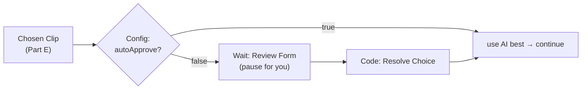

# Part F — Stage 3: The Manual Override (Review & Pick)

> **Goal:** add a human checkpoint. The workflow **pauses**, shows you the AI's candidates (with
> clickable preview frames), and lets you **approve**, **pick a different clip**, or **type exact
> start/end times**. A config switch lets you skip review and run fully automatic when you trust it.



---

## F1. Let the helper serve preview frames in a browser

So you can *see* the candidates, expose the media folder as static files. Add to `helper/app.py`
(near the top, after `app = FastAPI()`):

```python
from fastapi.staticfiles import StaticFiles
app.mount("/files", StaticFiles(directory=MEDIA), name="files")
```

Rebuild: `docker compose up -d --build helper`. Now a frame is viewable at, e.g.,
<http://localhost:8000/files/work/JOBID/frames/cand_0.jpg>.

---

## F2. Add a "Config" node (your Community-Edition substitute for Variables)

At the **start** of the workflow (right after the Schedule Trigger is fine, but easiest: just before
"Chosen Clip" logic). Add an **Edit Fields (Set)** node named `Config`. Keep Only Set Fields = ON:

| Name | Type | Value |
|---|---|---|
| `autoApprove` | Boolean | `false` |
| `clipLen` | Number | `15` |

> This single node is where you flip behavior. Set `autoApprove = true` later to run with no manual
> step. (Remember: CE has no global Variables, so a **Set node = your config**.)

For now, reference it where needed via `={{ $('Config').item.json.autoApprove }}`.

---

## F3. Branch: auto vs. manual

### Node — IF ("Need Review?")
- Add **IF** after **Chosen Clip**.
- Condition (Boolean): **Value 1** `={{ $('Config').item.json.autoApprove }}` — **Operator** `is true`.
- **true** output → goes straight to the next stage (Part G). 
- **false** output → goes to the review form below.

---

## F4. The review form (the "Wait" node)

### Node — Wait ("Review Form")
- Add node → **Wait**.
- **Resume:** `On Form Submitted`.
- **Form Title:** `Pick the clip to post`
- **Form Description** (paste — it builds clickable links to the candidate frames):
  ```
  ={{ "Job: " + $json.jobId + " — open these frames:\n" +
     $json.allCandidates.map(c =>
       (c.idx+1) + ") score " + c.final + " — " + c.reason +
       "  →  http://localhost:8000/files/" + c.frame_rel
     ).join("\n") }}
  ```
- **Form Fields** (click *Add Form Element* for each):

  | Field Label | Element | Options / Notes |
  |---|---|---|
  | `Which clip` | Dropdown | options: `AI best`, `Clip 1`, `Clip 2`, `Clip 3`, `Clip 4`, `Manual times` |
  | `Manual start` | Number | only used if you pick "Manual times" |
  | `Manual end` | Number | only used if you pick "Manual times" |

- Connect: **Need Review? (false) → Review Form**.

> ▶️ **How you actually review:** when the workflow reaches **Wait**, it pauses and shows a **form
> URL** (visible in the node's output / the execution view, like
> `http://localhost:5678/form-waiting/...`). Open it, click the frame links to eyeball each
> candidate, choose one (or type manual times), and **Submit** — the workflow resumes automatically.

---

## F5. Resolve the choice into final start/end

### Node — Code ("Resolve Choice")
- Add **Code** (JavaScript). Paste:
  ```js
  const form = $json;                                  // the form answers
  const chosen = $('Chosen Clip').first().json;        // the AI best
  const cands = $('Pick Best').first().json.allCandidates;

  let start = chosen.start, end = chosen.end;
  const pick = form['Which clip'];

  if (pick === 'Manual times') {
    start = Number(form['Manual start']);
    end   = Number(form['Manual end']);
  } else if (pick && pick.startsWith('Clip')) {
    const i = Number(pick.split(' ')[1]) - 1;
    if (cands[i]) { start = cands[i].start; end = cands[i].end; }
  }
  return [{ json: { jobId: chosen.jobId, name: chosen.name, path: chosen.path,
                    start, end } }];
  ```
- Connect: **Review Form → Resolve Choice**.

### Re-join the two paths
Both the **IF true** branch (auto) and **Resolve Choice** (manual) should feed the next stage. Add a
**Merge** node (Mode: *Choose Branch* / or just connect both outputs into the first node of Part G).
Simplest for now: connect **Need Review? (true) → (Part G start)** and **Resolve Choice → (Part G
start)**.

> The auto branch already has `start`/`end` on **Chosen Clip**; the manual branch produces the same
> shape from **Resolve Choice**. Downstream nodes don't care which path ran.

---

## F6. Test both modes

**Manual mode** (`autoApprove = false`):
1. Drop a clip, **Test workflow**.
2. When it pauses at **Review Form**, open the form URL, click a frame link or two, pick a clip,
   **Submit**.
3. **Resolve Choice** output should show your chosen `start`/`end`. ✅

**Auto mode:** set **Config → autoApprove = true**, run again — it should skip the form entirely.

---

## Cheat sheet — the Wait/Form node

| Thing | Where |
|---|---|
| Resume type for a pause-and-ask | Wait → **On Form Submitted** |
| The live form link | Wait node output / execution view (`/form-waiting/...`) |
| Reading a form answer | `={{ $json['Field Label'] }}` |
| Skip the human step | `Config.autoApprove = true` + IF branch |

---

## ✅ Checkpoint

- [ ] Frames open in your browser via `http://localhost:8000/files/...`.
- [ ] With `autoApprove=false`, the run **pauses** at a form you can submit.
- [ ] **Resolve Choice** outputs the right `start`/`end` for AI / specific clip / manual.
- [ ] With `autoApprove=true`, the form is skipped.

## 🧠 Memory Hooks

- **Wait = On Form Submitted** → that's your human-in-the-loop pause.
- **Set node "Config" = your Variables** (CE has none).
- **Both branches output the same shape** so Part G "just works."

## ➡️ Next

**Part G — Editing & Insta-Formatting**: cut the chosen window, crop to vertical **9:16**, auto color-
correct + normalize audio, and (optionally) run it through **ComfyUI** for extra polish. Say **"next"**.
