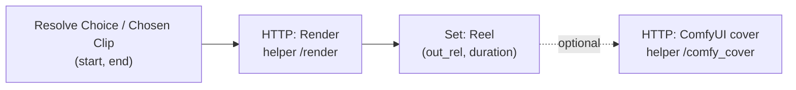
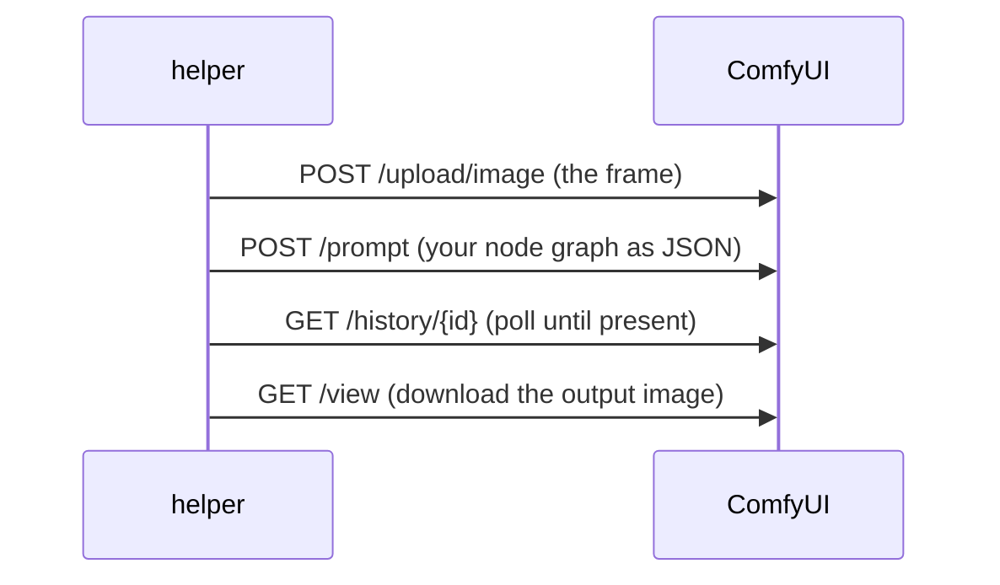

# Part G — Stage 4: Editing & Insta-Formatting

> **Goal:** turn the chosen window into a finished **Reel**: cut it, crop to vertical **9:16
> (1080×1920)**, auto color-correct + sharpen, normalize loudness to Instagram's level, and encode
> it correctly. An **optional ComfyUI** step adds AI polish when you want it.



---

## G1. Add the `/render` endpoint (the main editor — ffmpeg)

Add to `helper/app.py`:

```python
class RenderIn(BaseModel):
    path: str
    jobId: str
    start: float
    end: float

@app.post("/render")
def render(inp: RenderIn):
    src = os.path.join(MEDIA, inp.path)
    outdir = os.path.join(MEDIA, "output", inp.jobId)
    os.makedirs(outdir, exist_ok=True)
    out = os.path.join(outdir, "reel.mp4")
    dur = max(1.0, inp.end - inp.start)
    vf = ("scale=1080:1920:force_original_aspect_ratio=increase,"
          "crop=1080:1920,"
          "eq=contrast=1.06:saturation=1.18:brightness=0.02,"
          "unsharp=5:5:0.8")
    cmd = ["ffmpeg", "-y", "-ss", str(inp.start), "-t", str(dur), "-i", src,
           "-vf", vf, "-r", "30",
           "-c:v", "libx264", "-profile:v", "high", "-pix_fmt", "yuv420p", "-b:v", "6M",
           "-af", "loudnorm=I=-14:TP=-1.5:LRA=11",
           "-c:a", "aac", "-b:a", "128k", "-movflags", "+faststart", out]
    p = subprocess.run(cmd, capture_output=True, text=True)
    if not os.path.exists(out):
        return {"error": "render failed", "stderr": p.stderr[-800:]}
    info = probe(ProbeIn(path=f"output/{inp.jobId}/reel.mp4"))
    return {"out_rel": f"output/{inp.jobId}/reel.mp4",
            "out_url": f"/files/output/{inp.jobId}/reel.mp4",
            "duration": info["duration"], "size": info["size"]}
```

Rebuild: `docker compose up -d --build helper`.

### What each ffmpeg piece does (cheat sheet)

| Piece | Effect |
|---|---|
| `-ss start -t dur` | cut from `start` for `dur` seconds |
| `scale=…force_original_aspect_ratio=increase` + `crop=1080:1920` | fill a vertical 9:16 frame, center-cropped |
| `eq=contrast/saturation/brightness` | gentle color correction (more punch) |
| `unsharp` | subtle sharpening |
| `loudnorm=I=-14` | match Instagram's loudness target |
| `-pix_fmt yuv420p` + `+faststart` | maximum compatibility + instant playback |

> 🟥 **Vertical source already?** This still works (it just won't crop much). For landscape gameplay,
> the center crop keeps the middle action. Want a "blurred background" letterbox instead of cropping?
> That's a one-line swap in Part K's recipes.

---

## G2. n8n nodes for rendering

Continue after **Resolve Choice** (manual path) **and** the auto branch from Part F.

### Node — HTTP Request ("Render")
- **Method:** `POST` · **URL:** `http://helper:8000/render`
- **Body → JSON:**
  ```json
  {
    "path": "={{ $json.path }}",
    "jobId": "={{ $json.jobId }}",
    "start": "={{ $json.start }}",
    "end": "={{ $json.end }}"
  }
  ```
- **Options → Timeout:** `300000`.

### Node — Edit Fields ("Reel")
- Keep Only Set Fields = ON:

  | Name | Value |
  |---|---|
  | `jobId` | `={{ $('Resolve Choice').item.json.jobId ?? $('Chosen Clip').item.json.jobId }}` |
  | `name` | `={{ $('Chosen Clip').item.json.name }}` |
  | `out_rel` | `={{ $json.out_rel }}` |
  | `out_url` | `={{ $json.out_url }}` |
  | `duration` | `={{ $json.duration }}` |

**Test:** run the workflow. You should get `media/output/<job>/reel.mp4` — open it: vertical, color-
graded, ~15s. ✅ Play it in any player to confirm audio + framing.

---

## G3. (Optional) ComfyUI polish — AI cover/upscale

> ⚙️ **Optional & advanced.** ffmpeg already gives a clean Reel. Use ComfyUI when you want AI-grade
> upscaling or a stylized **cover image**. Full *video* through ComfyUI is a Part-K level-up; here we
> polish a **cover frame** via ComfyUI's API (no file-sharing headaches — we use its upload/view API).

### 1) Tell the helper where ComfyUI is
Add to the **helper** `environment:` in `docker-compose.yml`:
```yaml
      - COMFY_URL=http://host.docker.internal:8188
```

### 2) Add the `/comfy_cover` endpoint
```python
import time as _t
COMFY = os.environ.get("COMFY_URL", "http://host.docker.internal:8188")

class CoverIn(BaseModel):
    jobId: str
    frame_rel: str   # e.g. "work/<job>/frames/cand_0.jpg"

@app.post("/comfy_cover")
def comfy_cover(inp: CoverIn):
    frame = os.path.join(MEDIA, inp.frame_rel)
    with open(frame, "rb") as f:                      # 1) upload into ComfyUI
        up = requests.post(f"{COMFY}/upload/image",
                           files={"image": ("cover.jpg", f, "image/jpeg")},
                           data={"overwrite": "true"}, timeout=60).json()
    graph = {                                          # 2) simple 2x upscale graph
        "1": {"class_type": "LoadImage", "inputs": {"image": up["name"]}},
        "2": {"class_type": "ImageScaleBy",
              "inputs": {"image": ["1", 0], "upscale_method": "lanczos", "scale_by": 2.0}},
        "3": {"class_type": "SaveImage",
              "inputs": {"images": ["2", 0], "filename_prefix": "reelcover"}},
    }
    pid = requests.post(f"{COMFY}/prompt", json={"prompt": graph}, timeout=60).json()["prompt_id"]
    hist = {}
    for _ in range(60):                                # 3) poll until done
        hist = requests.get(f"{COMFY}/history/{pid}", timeout=30).json()
        if pid in hist:
            break
        _t.sleep(1)
    img_info = hist[pid]["outputs"]["3"]["images"][0]
    img = requests.get(f"{COMFY}/view", params={                 # 4) download result
        "filename": img_info["filename"],
        "subfolder": img_info.get("subfolder", ""),
        "type": img_info["type"]}, timeout=60)
    outdir = os.path.join(MEDIA, "output", inp.jobId)
    os.makedirs(outdir, exist_ok=True)
    with open(os.path.join(outdir, "cover.png"), "wb") as f:
        f.write(img.content)
    return {"cover_rel": f"output/{inp.jobId}/cover.png"}
```
Rebuild the helper.

### 3) The ComfyUI API pattern (memorize this 4-step dance)



> 🔧 **Make your own graphs:** build any workflow in the ComfyUI canvas, enable **Settings → Dev mode
> → "Save (API Format)"**, and it exports exactly the JSON shape used above. Swap that JSON into the
> endpoint to do upscaling-with-model, style filters, etc.

### 4) (Optional) call it from n8n
Add an **HTTP Request** "ComfyUI Cover" → `POST http://helper:8000/comfy_cover` with
`{ "jobId": "={{ $json.jobId }}", "frame_rel": "work/{{ $json.jobId }}/frames/cand_0.jpg" }`. Gate it
behind a `Config.fancy` boolean (IF node) so it only runs when you want it.

---

## ✅ Checkpoint

- [ ] `media/output/<job>/reel.mp4` is vertical 9:16, color-graded, correct loudness.
- [ ] The **Reel** Set node carries `out_rel`, `out_url`, `duration`.
- [ ] (Optional) `/comfy_cover` produces `output/<job>/cover.png`.

## 🧠 Memory Hooks

- **scale→crop = fill 9:16**, `eq`+`unsharp` = punch, `loudnorm -14` = IG audio.
- **ffmpeg by default; ComfyUI only when `fancy=true`.**
- **ComfyUI API = upload → prompt → history → view.**

## ➡️ Next

**Part H — Caption, Hashtags & Trends**: have Ollama write a caption, pick smart hashtags from your
pools, add mentions, and optionally weave in a trending topic. Say **"next"**.
