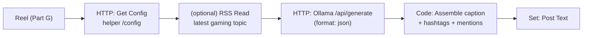

# Part H — Stage 5: Caption, Hashtags & Trending Topics

> **Goal:** auto-write an Instagram caption in your voice, pick **relevant hashtags** from your own
> pools (Instagram allows up to 30), add **mentions**, and optionally fold in a **trending topic**.
> All local, via Ollama.



---

## H1. Create your config files

Create `C:\gameplay-autopost\config\style.json`:

```json
{
  "game": "Valorant",
  "creator_handle": "@yourhandle",
  "tone": "hype, punchy, Gen-Z, confident, max 2 emojis",
  "always_mention": ["@valorant"],
  "banned_words": ["cringe", "noob"],
  "cta": "Follow for more clips"
}
```

Create `C:\gameplay-autopost\config\hashtags.json` (your pools — mix sizes for reach):

```json
{
  "core": ["#valorant", "#valorantclips", "#gaming"],
  "medium": ["#valorantmontage", "#fpsgames", "#gamingclips", "#valoranthighlights"],
  "niche": ["#valorantradiant", "#acewln", "#clutchorkick", "#valorantindia"]
}
```

> 💡 **Hashtag strategy:** a few **core** (huge, brand), several **medium** (your niche), several
> **niche** (low-competition where you can actually rank). The LLM will pick the most relevant for
> each clip from these pools.

## H2. Add a `/config` endpoint to the helper

```python
@app.get("/config")
def get_config():
    cfg = {}
    for fn in ["style.json", "hashtags.json"]:
        fp = os.path.join("/data/config", fn)
        if os.path.exists(fp):
            with open(fp, "r", encoding="utf-8") as f:
                cfg[fn.split(".")[0]] = json.load(f)
    return cfg
```
Rebuild: `docker compose up -d --build helper`.

---

## H3. n8n nodes

Continue after the **Reel** node.

### Node — HTTP Request ("Get Config")
- **Method:** `GET` · **URL:** `http://helper:8000/config`. Connect: **Reel → Get Config**.

### (Optional) Node — RSS Read ("Trending")
- Add node → **RSS Read**. **URL:** a gaming news feed, e.g. `https://www.pcgamer.com/rss/`.
- We'll use the newest item's title as a "trend hint." Connect **Get Config → Trending**.
- *(Skip this node if you don't want trend-flavored captions — just wire Get Config → Write Caption.)*

### Node — HTTP Request ("Write Caption")
- **Method:** `POST` · **URL:** `http://host.docker.internal:11434/api/generate`
- **Body → JSON:**
  ```json
  {
    "model": "llama3.1:8b",
    "stream": false,
    "format": "json",
    "prompt": "={{ 'You are a social media manager for a gaming creator. Write an Instagram Reel caption.\\n\\nGame: ' + $('Get Config').item.json.style.game + '\\nClip vibe: ' + $('Chosen Clip').item.json.reason + '\\nTone: ' + $('Get Config').item.json.style.tone + '\\nTrending topic (optional flavor): ' + ($('Trending').item.json.title || 'none') + '\\nCTA: ' + $('Get Config').item.json.style.cta + '\\n\\nFrom these hashtag pools pick the 12-18 MOST relevant: ' + JSON.stringify($('Get Config').item.json.hashtags) + '\\nAlways include these mentions: ' + JSON.stringify($('Get Config').item.json.style.always_mention) + '\\n\\nRespond ONLY as JSON: {\\\"caption\\\": \\\"<1-2 punchy lines, max 2 emojis>\\\", \\\"hashtags\\\": [\\\"#..\\\"], \\\"mentions\\\": [\\\"@..\\\"]}' }}"
  }
  ```
- **Options → Timeout:** `120000`. Connect: **Trending → Write Caption** (or Get Config → Write Caption).

> The `format: "json"` flag forces Ollama to return strict JSON, so the next node can parse it safely.

### Node — Code ("Assemble Post")
```js
const raw = $json.response;                 // JSON string from Ollama
let parsed;
try { parsed = JSON.parse(raw); }
catch (e) { parsed = { caption: raw, hashtags: [], mentions: [] }; }

const style = $('Get Config').first().json.style;
const reel  = $('Reel').first().json;

// de-dupe + cap at 30 hashtags
const tags = [...new Set((parsed.hashtags || []).map(t => t.startsWith('#') ? t : '#'+t))].slice(0, 30);
const mentions = [...new Set([...(parsed.mentions || []), ...(style.always_mention || [])])];

const fullCaption = [
  parsed.caption,
  '',
  mentions.join(' '),
  '',
  tags.join(' ')
].join('\n').trim();

return [{ json: {
  jobId: reel.jobId, name: reel.name, out_rel: reel.out_rel, out_url: reel.out_url,
  caption: parsed.caption, hashtags: tags, mentions, fullCaption
}}];
```
Connect: **Write Caption → Assemble Post**.

### Node — Edit Fields ("Post Text")
- Keep Only Set Fields = ON: copy `jobId`, `out_rel`, `out_url`, `fullCaption`,
  `caption`, `hashtags`, `mentions` (each `={{ $json.<field> }}`).
- Connect: **Assemble Post → Post Text**.

---

## H4. Test it

1. Run the workflow through to **Post Text**.
2. Check the output `fullCaption` — it should read like:
   ```
   Insane 1v3 clutch to win the round 🔥

   @valorant

   #valorant #valorantclips #clutchorkick #valoranthighlights ...
   ```
3. Tweak `style.json` tone/CTA and re-run until the voice feels right. No code changes needed.

> 🟥 **Caption came back as raw text, not JSON?** Make sure `"format": "json"` is in the body and
> the model is an instruct model (`llama3.1:8b` is). The Code node already falls back gracefully.

---

## Cheat sheet

| Want | Do |
|---|---|
| Change voice/tone | edit `style.json → tone` |
| Different game | edit `style.json → game` + swap `hashtags.json` pools |
| More/less hashtags | change "pick 12–18" in the prompt |
| No trend flavor | delete the RSS Read node |
| Auto-detect the game | add an Ollama **vision** call on `cover.jpg` asking "name the game" |

---

## ✅ Checkpoint

- [ ] `/config` returns your `style` + `hashtags`.
- [ ] **Write Caption** returns valid JSON (caption/hashtags/mentions).
- [ ] **Post Text** has a clean `fullCaption` with mentions + ≤30 hashtags.

## 🧠 Memory Hooks

- **`format:"json"`** makes Ollama return parseable JSON.
- **Pools + LLM pick** = relevant hashtags, not spam. **Cap at 30.**
- **`style.json` is your brand brain** — edit it, not the workflow.

## ➡️ Next

**Part I — Posting to Instagram**: the account setup (official API vs. the no-Page fallback), getting
tokens, and publishing the Reel with your caption. Say **"next"**.
