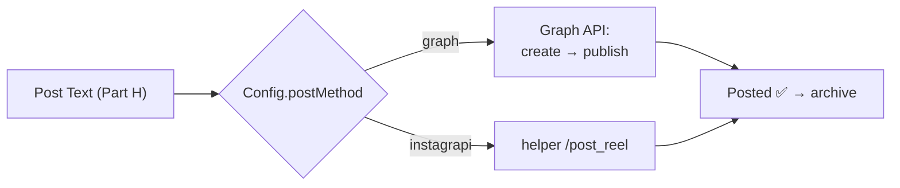
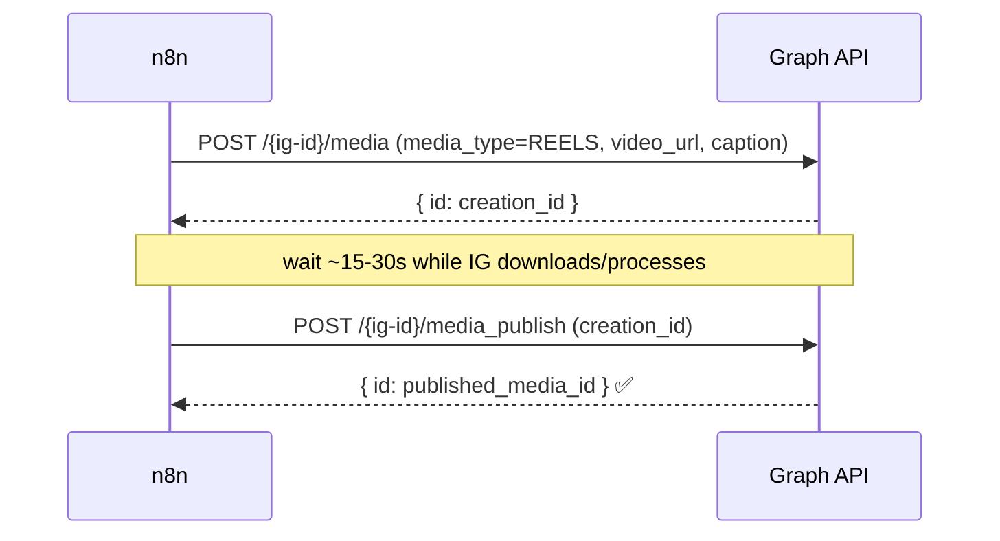

# Part I — Stage 6: Posting to Instagram

> **Goal:** publish the finished Reel + caption to Instagram. There are **two paths** — pick one:
>
> - **Path A — Official Graph API (recommended):** reliable, allowed, free. **Requires linking your
>   Creator account to a Facebook Page** (≈5 min, stays invisible).
> - **Path B — Unofficial (instagrapi):** works with **no Page**, posts local files directly, **but
>   it logs in like a human → against Instagram's TOS and can get your account blocked.**

> 🟥 **Honest recommendation:** do **Path A**. You said your Creator account isn't linked to a Page
> yet — adding one is quick, doesn't change how your profile looks, and removes all the ban risk.
> Use Path B only as a stop-gap and **only on a throwaway account**.



Add one field to your **Config** node: `postMethod` = `graph` (or `instagrapi`).

---

## PATH A — Official Instagram Graph API

### A1. One-time account setup (do this once)

1. **Create a Facebook Page** (free): <https://www.facebook.com/pages/create> — any name; you never
   have to post on it.
2. **Make your IG account Business/Creator** and **link it to the Page**: Instagram app → *Settings →
   Account type and tools* → ensure Professional → *Page* → connect your new Page. (Or do it from
   **Meta Business Suite**.)
3. **Create a Meta app:** <https://developers.facebook.com/apps> → **Create App** → type **Business**.
4. Add the **Instagram** product (Instagram Graph API / "Instagram" with content publishing).
5. In **Graph API Explorer** (<https://developers.facebook.com/tools/explorer>): select your app,
   generate a **User token** with these permissions:
   `instagram_basic`, `instagram_content_publish`, `pages_show_list`, `pages_read_engagement`,
   `business_management`.
6. **Get your IG User ID:** call `GET /me/accounts` → find your Page → then
   `GET /{page-id}?fields=instagram_business_account`. That returns your **IG user ID** (a long number).
7. **Get a long-lived token (~60 days):** exchange the short token:
   ```
   GET https://graph.facebook.com/v21.0/oauth/access_token
       ?grant_type=fb_exchange_token&client_id={APP_ID}
       &client_secret={APP_SECRET}&fb_exchange_token={SHORT_TOKEN}
   ```
   Save the returned long-lived token. (Part K covers auto-refreshing it.)

> 🧠 **Plain English:** the **token** is a temporary password that lets your workflow post for you;
> the **IG User ID** says *which* account to post to.

### A2. The publishing flow (how Reels post via API)



> 🟥 **The big gotcha:** `video_url` must be a **public HTTPS URL** that Instagram can download — a
> local file path will **not** work. We expose your local `output/` folder temporarily with a free
> **Cloudflare tunnel**.

### A3. Expose the Reel with a free tunnel (Cloudflare)

1. Download **cloudflared** for Windows:
   <https://developers.cloudflare.com/cloudflare-one/connections/connect-networks/downloads/>
2. Run a quick tunnel pointing at your helper:
   ```powershell
   cloudflared tunnel --url http://localhost:8000
   ```
3. It prints a URL like `https://random-words.trycloudflare.com`. Put it in your **Config** node as
   `publicBase`. Your Reel is then reachable at `={{ publicBase }}/files/<out_rel>`.

> Keep this window open while posting. (Part K shows how to make this automatic/persistent.)

### A4. Store the token safely in n8n

1. n8n left bar → **Credentials → New** → search **"Query Auth"** (Generic).
2. **Name:** `access_token` · **Value:** *(paste your long-lived token)* · Save as `IG Graph Token`.
   (This appends `?access_token=…` to requests so the secret never sits in the workflow body.)

### A5. n8n nodes (Path A)

Add after **Post Text**, behind a **Switch** on `={{ $('Config').item.json.postMethod }}`
(output `graph`).

**Node — HTTP Request ("IG: Create Container")**
- **Method:** `POST`
- **URL:** `https://graph.facebook.com/v21.0/{{ $('Config').item.json.igUserId }}/media`
- **Authentication:** Generic → **Query Auth** → credential `IG Graph Token`.
- **Send Query Parameters** = ON:

  | Name | Value |
  |---|---|
  | `media_type` | `REELS` |
  | `video_url` | `={{ $('Config').item.json.publicBase }}/files/{{ $json.out_rel }}` |
  | `caption` | `={{ $json.fullCaption }}` |

**Node — Wait ("Let IG process")**
- **Resume:** `After Time Interval` → **30 seconds**. Connect: Create Container → Wait.

**Node — HTTP Request ("IG: Publish")**
- **Method:** `POST`
- **URL:** `https://graph.facebook.com/v21.0/{{ $('Config').item.json.igUserId }}/media_publish`
- **Authentication:** Query Auth → `IG Graph Token`.
- **Query Parameters:** `creation_id` = `={{ $('IG: Create Container').item.json.id }}`

Add `igUserId` and `publicBase` to your **Config** node. **Test** with a clip → it should appear on
your Instagram. ✅

> 🟥 **Status not FINISHED / publish fails fast?** IG was still processing. Increase the Wait, or
> poll `GET /v21.0/{creation_id}?fields=status_code` in a loop until it returns `FINISHED` before
> publishing (more robust — see Part K).

---

## PATH B — Unofficial fallback (instagrapi, no Page needed)

> ⚠️ **Risks (read first):** this logs in with your username/password and automates a human-only
> flow. It **violates Instagram's Terms**, can trigger **action-blocks or bans**, and may break
> anytime IG changes. **Use a burner/throwaway Creator account, post sparingly, and never your main.**

### B1. Add credentials to `.env`
```ini
IG_USERNAME=your_burner_username
IG_PASSWORD=your_burner_password
```
Add them to the **helper** service `environment:` in compose:
```yaml
      - IG_USERNAME=${IG_USERNAME}
      - IG_PASSWORD=${IG_PASSWORD}
```

### B2. Add the `/post_reel` endpoint
```python
class PostIn(BaseModel):
    out_rel: str
    caption: str

@app.post("/post_reel")
def post_reel(inp: PostIn):
    from instagrapi import Client
    sess = "/data/config/ig_session.json"
    cl = Client()
    if os.path.exists(sess):
        cl.load_settings(sess)           # reuse session → fewer logins = safer
    cl.login(os.environ["IG_USERNAME"], os.environ["IG_PASSWORD"])
    cl.dump_settings(sess)
    path = os.path.join(MEDIA, inp.out_rel)
    media = cl.clip_upload(path, inp.caption)   # clip_upload = Reels
    return {"ok": True, "code": media.code, "pk": str(media.pk)}
```
Rebuild: `docker compose up -d --build helper`.

> 🟥 **2FA:** if your burner has 2FA on, login needs a code (`cl.login(user, pwd,
> verification_code="123456")`). Easiest for a burner: keep it simple, log in once from the same IP
> so the saved session sticks.

### B3. n8n node (Path B)
From the **Switch** output `instagrapi`:

**Node — HTTP Request ("IG: Post via Helper")**
- **Method:** `POST` · **URL:** `http://helper:8000/post_reel`
- **Body → JSON:**
  ```json
  { "out_rel": "={{ $json.out_rel }}", "caption": "={{ $json.fullCaption }}" }
  ```
- **Options → Timeout:** `300000`. (No tunnel needed — it uploads the local file directly.)

---

## I-final. Archive after posting

Add a tiny helper endpoint + node so posted clips move out of `work/`.

```python
class ArchiveIn(BaseModel):
    jobId: str

@app.post("/archive")
def archive(inp: ArchiveIn):
    src = os.path.join(MEDIA, "work", inp.jobId)
    dst = os.path.join(MEDIA, "archive", inp.jobId)
    if os.path.exists(src):
        shutil.move(src, dst)
    return {"archived": inp.jobId}
```

n8n: after **either** posting branch → **HTTP Request "Archive"** → `POST http://helper:8000/archive`
with `{ "jobId": "={{ $json.jobId }}" }`. Use a **Merge** to join both branches into this one node.

---

## Which path? (quick compare)

| | Path A — Graph API | Path B — instagrapi |
|---|---|---|
| Needs Facebook Page | ✅ yes (5 min) | ❌ no |
| Allowed / TOS-safe | ✅ yes | ❌ no (ban risk) |
| Needs public URL (tunnel) | ✅ yes | ❌ no |
| Reliability | ✅ high | ⚠️ flaky |
| Best for | real use | quick test on a burner |

---

## ✅ Checkpoint

- [ ] (Path A) Page linked, token + IG User ID in **Config**, tunnel running, Reel posts.
- [ ] (Path B) burner creds set, `/post_reel` posts a Reel.
- [ ] After posting, the job folder moves to `media/archive/<job>/`.

## 🧠 Memory Hooks

- **Graph API = create container → wait → publish.** `video_url` must be **public HTTPS** (tunnel).
- **Token = temp password, IG User ID = which account.**
- **instagrapi = no Page but TOS risk → burner only.**

## ➡️ Next

**Part J — The Full Workflow Assembled**: wire all stages end-to-end, add error handling + retries +
a failure alert, and split into tidy sub-workflows. Say **"next"**.
