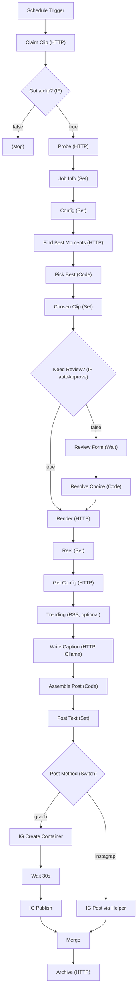

# Part J — The Full Workflow Assembled

> **Goal:** connect every stage into one reliable pipeline, add **retries** + **error alerts** so a
> single hiccup doesn't kill a run, and (optionally) split into tidy **sub-workflows**. Then back it
> up.

---

## J1. The complete node order (one workflow)

Here's the full chain you've built across Parts D→I, in order:



> 🔎 **Two "config" things, don't confuse them:**
> - **Config (Set node)** = runtime *toggles* (`autoApprove`, `postMethod`, `igUserId`, `publicBase`,
>   `clipLen`, `game`).
> - **Get Config (HTTP /config)** = loads your *content* files (`style.json`, `hashtags.json`).

### Your full Config node (final field list)

| Field | Type | Example |
|---|---|---|
| `autoApprove` | Boolean | `false` |
| `clipLen` | Number | `15` |
| `postMethod` | String | `graph` |
| `igUserId` | String | `17841400000000000` |
| `publicBase` | String | `https://abc-xyz.trycloudflare.com` |
| `fancy` | Boolean | `false` |

---

## J2. Make it resilient — retries

For every node that calls something external, turn on auto-retry:

1. Click the node → **Settings** tab.
2. **Retry On Fail** = ON · **Max Tries** = `3` · **Wait Between Tries** = `5000` ms.

Apply to: **Claim Clip, Probe, Find Best Moments, Render, Get Config, Write Caption, IG Create
Container, IG Publish, IG Post via Helper, Archive.**

For **optional** nodes that shouldn't break the run, instead set **Continue On Fail** = ON:
**Trending (RSS)** and any **ComfyUI Cover** node.

---

## J3. Catch failures — an Error Handler workflow

### 1) Add a log endpoint to the helper
```python
@app.post("/log")
def log(item: dict):
    p = os.path.join(MEDIA, "archive", "run.log")
    with open(p, "a", encoding="utf-8") as f:
        f.write(json.dumps(item) + "\n")
    return {"ok": True}
```
Rebuild: `docker compose up -d --build helper`.

### 2) Build a tiny workflow named `0 - Error Handler`
- Node 1: **Error Trigger** (fires whenever another workflow errors).
- Node 2: **HTTP Request** → `POST http://helper:8000/log` with body:
  ```json
  {
    "when": "={{ $now }}",
    "workflow": "={{ $json.workflow.name }}",
    "error": "={{ $json.execution.error.message }}",
    "node": "={{ $json.execution.lastNodeExecuted }}"
  }
  ```
- *(Optional)* Add a second HTTP node to ping a **Discord webhook** so you get a phone notification:
  `POST <your_discord_webhook_url>` body `{ "content": "🚨 Pipeline failed: {{ $json.execution.error.message }}" }`.

### 3) Attach it to the main workflow
Open the main workflow → **⋯ menu → Settings → Error Workflow** → choose **`0 - Error Handler`**.
Now any failure is logged (and optionally pinged) with the exact node + message.

---

## J4. (Optional) Split into sub-workflows

For tidiness once it works, you can break the monster into reusable pieces:

| Sub-workflow | Does |
|---|---|
| `1 - Ingest` | claim + probe → returns `jobId, path` |
| `2 - Highlight` | candidates + pick + review → returns `start, end` |
| `3 - Render` | render → returns `out_rel` |
| `4 - Caption` | caption + hashtags → returns `fullCaption` |
| `5 - Post` | publish + archive |

Pattern: each sub-workflow starts with an **Execute Sub-workflow Trigger**; the main flow calls them
with **Execute Sub-workflow** nodes, passing `jobId` along. Same logic, easier to debug. *(Optional —
the single workflow is totally fine to keep.)*

---

## J5. Back it up (do this now!)

| What | How |
|---|---|
| **Workflows** | Each workflow → **⋯ → Download** → save the JSON into `config/workflows/` |
| **n8n data** (incl. credentials) | copy the `n8n-data/` folder somewhere safe |
| **Database** | `docker compose exec postgres pg_dump -U n8n n8n > backup.sql` |
| **Secrets** | back up `.env` (it holds your encryption key + passwords) |
| **Helper code + config** | copy `helper/` and `config/` |

> 🟥 Losing `N8N_ENCRYPTION_KEY` (in `.env`) makes saved credentials unreadable. Back up `.env`.

---

## ✅ Checkpoint

- [ ] One run goes Schedule → … → Archive with no manual fixes (auto mode).
- [ ] External nodes have **Retry On Fail**; optional nodes have **Continue On Fail**.
- [ ] `0 - Error Handler` logs failures (check `media/archive/run.log`).
- [ ] You exported the workflow JSON + backed up `.env`.

## 🧠 Memory Hooks

- **Config (toggles) ≠ Get Config (content files).**
- **Retry external, Continue-On-Fail optional.**
- **Error Workflow = your safety net.** Back up `.env` (the key!).

## ➡️ Next

**Part K — Run, Troubleshoot & Level Up**: the daily routine, a master troubleshooting table, AMD
performance tips, Instagram limits/TOS, and concrete upgrades (subtitles, blurred-letterbox,
multi-platform). Say **"next"**.
