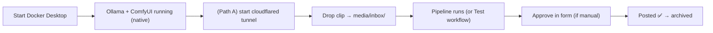

# Part K — Run, Troubleshoot & Level Up

> **Goal:** your day-to-day operating manual — how to run it, fix it when it breaks, squeeze AMD
> performance, stay inside Instagram's rules, and the best upgrades to add next.

---

## K1. The daily routine



**Start-up checklist:**
```powershell
cd C:\gameplay-autopost
docker compose up -d                 # n8n + postgres + helper
# make sure Ollama (tray) and ComfyUI (bat) are running natively
cloudflared tunnel --url http://localhost:8000   # only for Path A; copy URL → Config.publicBase
```
Then drop a clip in `media\inbox\` and watch it on the n8n **Executions** page.

**Watch the logs:**
```powershell
docker compose logs -f n8n
docker compose logs -f helper
```

---

## K2. Master troubleshooting table

| Symptom | Likely cause | Fix |
|---|---|---|
| n8n can't reach Ollama | used `localhost`, or Ollama not on `0.0.0.0` | URL = `host.docker.internal:11434`; `setx OLLAMA_HOST "0.0.0.0"` → **restart Ollama** |
| `ollama ps` shows **CPU** | driver/detect | update AMD Adrenalin, reboot |
| n8n can't reach helper | wrong host | from n8n use `http://helper:8000` (not localhost) |
| Clip never processes | not `.mp4`, or stuck in `inbox` | check extension; check `/claim`; look at Executions |
| All candidates score ~5 | llava returned non-JSON / timed out | `ollama pull llava:13b`, set `VISION_MODEL`; confirm GPU |
| `render failed` | bad path / codec | read `stderr` in the response; verify source plays |
| ComfyUI `/prompt` 404 or refused | not started with `--listen 0.0.0.0`, or wrong node class | add `--listen 0.0.0.0`; verify node `class_type` names |
| IG "create container" error | token expired / missing scope / `video_url` not public | refresh token (K5); ensure tunnel running; check permissions |
| IG publish: *media not ready* | IG still processing | increase Wait, or poll `status_code` until `FINISHED` (K6) |
| instagrapi `challenge_required` | new IP / 2FA | log in once from same IP; keep `ig_session.json`; burner only |
| Tunnel URL stopped working | `trycloudflare` URL is new each run | paste the current URL into `Config.publicBase`, or use a named tunnel (K5) |
| Credentials unreadable after rebuild | lost encryption key | restore `.env` `N8N_ENCRYPTION_KEY` |

---

## K3. AMD 7900 XT performance tips

| Area | Tip |
|---|---|
| **Ollama** | Auto-uses your GPU via ROCm. 20 GB VRAM = you can run `llava:13b` / `llama3.2-vision:11b` comfortably for sharper scoring. |
| **ComfyUI** | **ZLUDA** build is fastest on RDNA3; the **first** run compiles kernels (slow once, fast after). DirectML works but is slower. |
| **ffmpeg speed** | The helper's ffmpeg is **CPU** (fine for <60s clips). For long clips, run ffmpeg **natively** and swap `-c:v libx264` → `-c:v h264_amf` to use your GPU encoder. |
| **Keep it snappy** | Leave `fancy=false` for normal clips; only invoke ComfyUI when you actually want AI polish. |
| **VRAM** | If you ever load big vision + ComfyUI models at once, watch VRAM in Adrenalin; unload one if needed. |

---

## K4. Instagram limits & staying safe (TOS)

- **Graph API publishing cap:** ~**25 posts per 24h** per account. Space posts out.
- **Don't spam hashtags/mentions** — keep ≤30 tags, relevant only.
- **instagrapi (Path B):** every extra login/action raises ban risk. **Burner only**, post sparingly,
  reuse the saved session.
- **Tunnel exposure:** a `trycloudflare` URL is public while open — anyone with the link can fetch
  that file. Only run the tunnel while posting, then close it.
- **Don't expose n8n (`5678`) to the internet.** Keep it local. If you ever must, add auth + HTTPS.

---

## K5. Make Path A "set and forget"

### Auto-refresh the long-lived token (before it expires ~60 days)
Build a small scheduled workflow:
- **Schedule Trigger** (every 30 days) → **HTTP Request**:
  `GET https://graph.facebook.com/v21.0/oauth/access_token?grant_type=fb_exchange_token&client_id={APP_ID}&client_secret={APP_SECRET}&fb_exchange_token={CURRENT_TOKEN}`
- Save the new token into your credential (or a file via a helper `/token` endpoint).

### A stable tunnel URL (instead of random each run)
A free `trycloudflare` URL changes every run. For a **fixed** URL, set up a **named** Cloudflare
tunnel with your own domain (Cloudflare Zero Trust → Tunnels), then `Config.publicBase` never
changes. *(Optional — fine to paste the URL each session while testing.)*

---

## K6. Robust IG publish (replace the fixed Wait)

Instead of "Wait 30s", poll until ready:

- **HTTP Request "Check Status":** `GET https://graph.facebook.com/v21.0/{{creation_id}}?fields=status_code`
- **IF** `status_code == FINISHED` → publish; **else** → **Wait 10s** → loop back to Check Status.

This handles longer videos that need more processing time.

---

## K7. Best upgrades to add next (concrete recipes)

### 🅰️ Burned-in captions/subtitles (great for retention)
Add **faster-whisper** to the helper (`pip install faster-whisper`), transcribe the clip to an `.srt`,
then burn it in:
```bash
ffmpeg -i reel.mp4 -vf "subtitles=subs.srt:force_style='Alignment=2,FontSize=18'" out.mp4
```

### 🅱️ Blurred-letterbox instead of center-crop (keeps full frame)
Swap the `-vf` in `/render` for:
```text
split[a][b];[a]scale=1080:1920,boxblur=20:5[bg];[b]scale=1080:-1[fg];[bg][fg]overlay=(W-w)/2:(H-h)/2
```

### Other level-ups
| Upgrade | How |
|---|---|
| **Auto-detect the game** | Ollama vision on `cover.jpg` → put result in caption prompt |
| **YouTube Shorts too** | add a branch using the **YouTube** node to upload the same `reel.mp4` |
| **Best-time scheduling** | queue finished reels; a Schedule Trigger posts at peak hours |
| **Analytics** | Graph API `GET /{media-id}/insights` → log views/likes |
| **Phone alerts** | Discord/Telegram node on success + failure |
| **Thumbnails** | reuse the ComfyUI cover from Part G as the Reel cover |

---

## K8. Update & maintain

```powershell
cd C:\gameplay-autopost
docker compose pull            # get newest n8n + postgres images
docker compose up -d --build   # rebuild helper + apply
docker image prune -f          # clean old images
```
Update Ollama/ComfyUI natively from their own updaters. Re-pull models occasionally:
`ollama pull llama3.1:8b`.

---

## ✅ You did it — definition of "done"

- [ ] Drop a clip → it auto-cuts the best moment, formats a 9:16 Reel, writes a caption, and posts.
- [ ] Manual override works when you want it; auto mode works when you don't.
- [ ] Failures get logged; you can restart everything with `docker compose up -d`.

## 🧠 Memory Hooks

- **Start: Docker up → Ollama/ComfyUI native → tunnel (Path A) → drop clip.**
- **90% of bugs = `host.docker.internal` vs `helper` vs `localhost`.** Check the address first.
- **Burner + sparing posts** if you ever use Path B.

## 🎓 Honest closer

You now have a complete local pipeline. The build is done — but "production-smooth" comes from
**running real clips through it** and tuning: the vision model size, the `0.6/0.4` weights, your
`style.json` voice, and clip length. Start in **manual mode**, watch a handful of clips, then flip
`autoApprove=true` once you trust the picks.

Want me to: (a) generate a **ready-to-paste workflow JSON** so you skip manual node-building, (b) add
the **subtitles** or **blurred-letterbox** recipe into the helper now, or (c) write a **one-page
quick-start** that condenses Parts B–I? Just say which.
