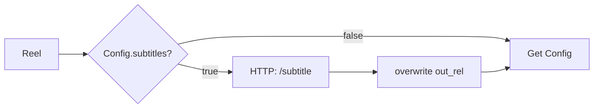

# Part M — Helper Add-ons: Subtitles (Whisper) + Blurred-Letterbox

> **What this is:** two high-impact upgrades dropped straight into your helper service —
> **auto-subtitles** (great for watch-time) and a **blurred-letterbox** format (keeps the whole frame
> instead of center-cropping). Both are local; subtitles use **faster-whisper**.

---

## M1. Blurred-letterbox mode (keep the full frame)

Center-crop (Part G) zooms into the middle. **Letterbox** shows the whole gameplay frame on a
blurred fill — often nicer for wide HUDs/minimaps.

### 1) Make `/render` accept a `mode`
Replace your `/render` in `helper/app.py` with this version (adds a `mode` field: `crop` or
`letterbox`):

```python
class RenderIn(BaseModel):
    path: str
    jobId: str
    start: float
    end: float
    mode: str = "crop"          # "crop" or "letterbox"

@app.post("/render")
def render(inp: RenderIn):
    src = os.path.join(MEDIA, inp.path)
    outdir = os.path.join(MEDIA, "output", inp.jobId)
    os.makedirs(outdir, exist_ok=True)
    out = os.path.join(outdir, "reel.mp4")
    dur = max(1.0, inp.end - inp.start)
    grade = "eq=contrast=1.06:saturation=1.18:brightness=0.02,unsharp=5:5:0.8"
    if inp.mode == "letterbox":
        vf = ("split[a][b];"
              "[a]scale=1080:1920,boxblur=20:5[bg];"
              "[b]scale=1080:-1[fg];"
              "[bg][fg]overlay=(W-w)/2:(H-h)/2," + grade)
    else:
        vf = ("scale=1080:1920:force_original_aspect_ratio=increase,"
              "crop=1080:1920," + grade)
    cmd = ["ffmpeg", "-y", "-ss", str(inp.start), "-t", str(dur), "-i", src,
           "-vf", vf, "-r", "30",
           "-c:v", "libx264", "-profile:v", "high", "-pix_fmt", "yuv420p", "-b:v", "6M",
           "-af", "loudnorm=I=-14:TP=-1.5:LRA=11",
           "-c:a", "aac", "-b:a", "128k", "-movflags", "+faststart", out]
    p = subprocess.run(cmd, capture_output=True, text=True)
    if not os.path.exists(out):
        return {"error": "render failed", "stderr": p.stderr[-800:]}
    info = probe(ProbeIn(path=f"output/{inp.jobId}/reel.mp4"))
    return {"out_rel": f"output/{inp.jobId}/reel.mp4",
            "out_url": f"/files/output/{inp.jobId}/reel.mp4",
            "duration": info["duration"], "size": info["size"]}
```

### 2) Pick the mode from n8n
In the **Config** node add a field `renderMode` (`crop` or `letterbox`), then in the **Render**
HTTP node's JSON body add it:
```json
{ "path": "={{ $json.path }}", "jobId": "={{ $json.jobId }}",
  "start": "={{ $json.start }}", "end": "={{ $json.end }}",
  "mode": "={{ $('Config').item.json.renderMode }}" }
```

| Mode | Look | Best for |
|---|---|---|
| `crop` | zoom to center, fills screen | tight action, FPS crosshair |
| `letterbox` | full frame on blurred bg | wide HUD, racing, strategy |

---

## M2. Auto-subtitles with faster-whisper

### 1) Add the dependency
Append to `helper/requirements.txt`:
```text
faster-whisper
```

### 2) Add a model cache volume (so it doesn't re-download each rebuild)
In `docker-compose.yml`, add a volume to the **helper** service:
```yaml
      - ./helper/models:/root/.cache/huggingface
```

### 3) Add the `/subtitle` endpoint to `helper/app.py`
```python
from faster_whisper import WhisperModel
_WMODEL = None

def _whisper():
    global _WMODEL
    if _WMODEL is None:
        # "base" is fast on CPU; use "small" for better accuracy
        _WMODEL = WhisperModel("base", device="cpu", compute_type="int8")
    return _WMODEL

def _fmt_ts(t):
    h = int(t // 3600); m = int((t % 3600) // 60); s = t % 60
    return f"{h:02d}:{m:02d}:{s:06.3f}".replace(".", ",")

class SubIn(BaseModel):
    jobId: str
    out_rel: str

@app.post("/subtitle")
def subtitle(inp: SubIn):
    src = os.path.join(MEDIA, inp.out_rel)
    outdir = os.path.join(MEDIA, "output", inp.jobId)
    srt = os.path.join(outdir, "subs.srt")
    segments, _ = _whisper().transcribe(src)
    with open(srt, "w", encoding="utf-8") as f:
        for i, seg in enumerate(segments, 1):
            f.write(f"{i}\n{_fmt_ts(seg.start)} --> {_fmt_ts(seg.end)}\n{seg.text.strip()}\n\n")
    out = os.path.join(outdir, "reel_subbed.mp4")
    style = "force_style='Alignment=2,FontSize=18,Outline=2,Shadow=0,MarginV=60'"
    subprocess.run(["ffmpeg", "-y", "-i", src,
                    "-vf", f"subtitles={srt}:{style}",
                    "-c:a", "copy", out], capture_output=True)
    return {"out_rel": f"output/{inp.jobId}/reel_subbed.mp4",
            "out_url": f"/files/output/{inp.jobId}/reel_subbed.mp4"}
```

Rebuild: `docker compose up -d --build helper`. (First call downloads the Whisper model — give it a
minute once.)

### 4) Wire it into n8n (after **Reel**, before **Get Config**)
- Add **HTTP Request** "Subtitle": `POST http://helper:8000/subtitle`, JSON body
  `{ "jobId": "={{ $json.jobId }}", "out_rel": "={{ $json.out_rel }}" }`, **Timeout** `300000`.
- Then update everything downstream that used `out_rel` to use the **subbed** file. Easiest: add an
  **Edit Fields** that overwrites `out_rel` = `={{ $json.out_rel }}` (the subbed path) and `out_url`
  similarly, so posting picks up the captioned version.
- Gate it behind a `Config.subtitles` boolean (IF node) so you can turn it off.



---

## M3. Tuning cheat sheet

| Want | Do |
|---|---|
| More accurate captions | use `WhisperModel("small")` (slower) |
| Bigger/positioned subtitles | tweak `FontSize` / `MarginV` in `style` |
| Subtitles only on long clips | add a duration check in the IF |
| Faster letterbox blur | lower `boxblur=20:5` numbers |

> 🟥 **Whisper is CPU here** (the helper container can't use your AMD GPU). For 15–30s reels that's
> fine. If you later run the helper natively with a GPU build, switch `device="cuda"`.

---

## ✅ Checkpoint

- [ ] `/render` supports `mode: "letterbox"`.
- [ ] `/subtitle` produces `reel_subbed.mp4` with burned-in captions.
- [ ] Posting uses the captioned file when `Config.subtitles = true`.

## 🧠 Memory Hooks

- **Letterbox = full frame on blur; crop = zoomed center.**
- **Whisper → SRT → ffmpeg `subtitles=` burns them in.**
- **Overwrite `out_rel`** so the rest of the flow posts the right file.

## ➡️ Related

Pair these with the importable flow in [Part L](Part-L-Ready-To-Import-Workflow.md) and the ops tips
in [Part K](Part-K-Run-Troubleshoot-Level-Up.md).
